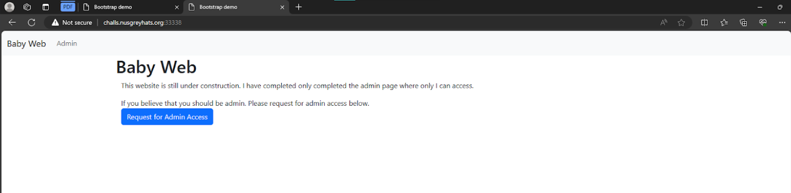
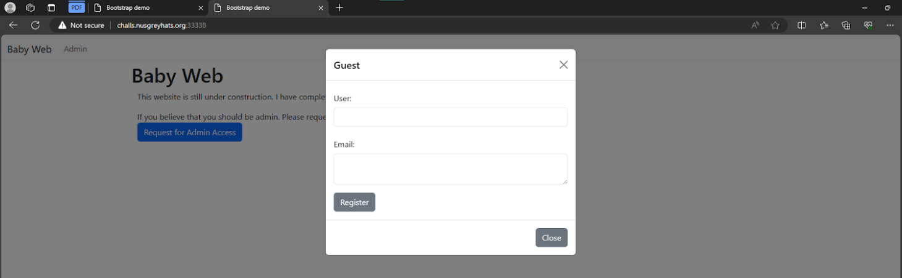
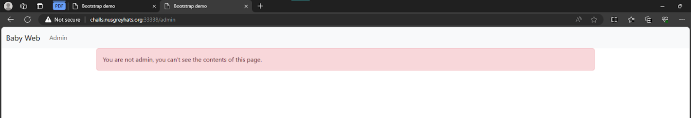
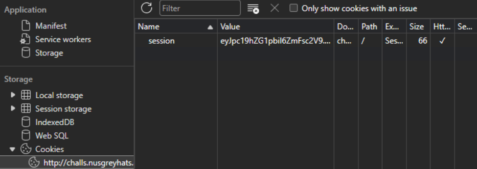
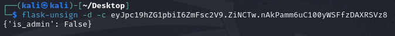
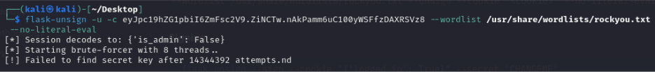
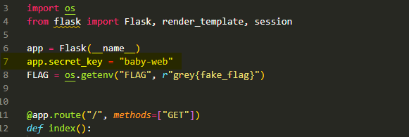
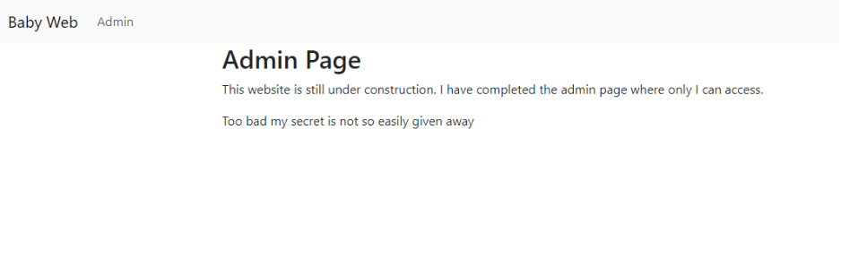
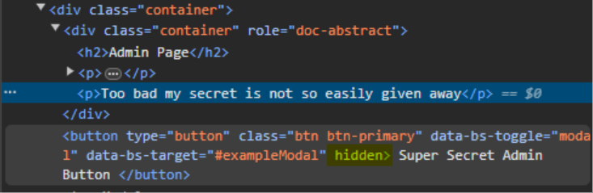
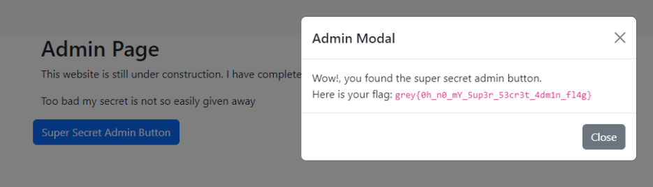

# [WEB] Baby Web
## Description
I just learnt how to design my favourite `flask` webpage using `htmx` and `bootstrap`. I hope I don't accidentally expose my super secret flag.

Author: Junhua

http://challs.nusgreyhats.org:33338

## Approach
By entering the link, we are greeted with the following landing page, which consists of an Admin navbar button and another button on the home page to request for admin access:

Clicking on the "Request for admin access" button brings up a form but I doubt the form will be useful for solving the challenge.

Visiting the admin page tells us that we are not an admin, and thus we are unable to view the page contents.

Usually when it comes to solving these web challenges, the ability to perform administratives stuff is determined by some sort of `is_admin` flag within our user token or session cookie. 
Opening up the browser devtools and navigating to the `Applications` tab allows us to view our cookies.
We see that there is indeed a session cookie stored within the browser.
> eyJpc19hZG1pbiI6ZmFsc2V9.ZiNCTw.nAkPamm6uC100yWSFfzDAXRSVz8

Knowing that the web application was created with flask, `We can use the tool `flask-unsign` to decrypt the session cookie.
> {'is_admin': False}

Great! Now that we know that our `is_admin` flag is being stored in the session cookie with a value of `false`, we just need to create a new cookie with the flag set to `True`.
Once again, we can use `flask-unsign` to do this for us. But before that, we need to obtain the secret key used to sign the cookie. 
To do that, I tried to brute-force the secret key using rockyou.txt, however, that failed.

Then I remembered that the source code was already provided for us and the key could be hardcoded within.

Remember to study the source code provided next time guys :p

Using the secret key, we sign our new cookie.
> eyJpc19hZG1pbiI6dHJ1ZX0.ZiM_4g.YzRHfLlJ5GHGLbax4UVz56pdGzo

Replace our new cookie value into the "Value" field of the "session" cookie in our Browser's devtools and enter the admin page again.
This time, the content of the webpage appears different.

It appears that we have reached a dead end, but inspecting the page's source code reveals that there is a hidden button:

We just need to remove the hidden attribute on the button and click it, revealing the flag:

Flag: `grey{0h_n0_mY_5up3r_53cr3t_4dmin_fl4g}`

