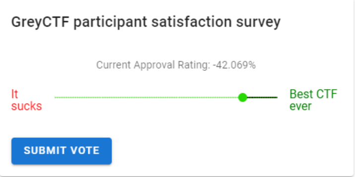
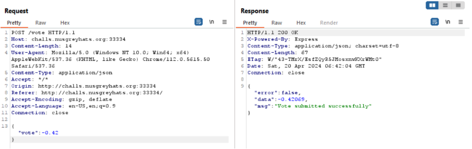
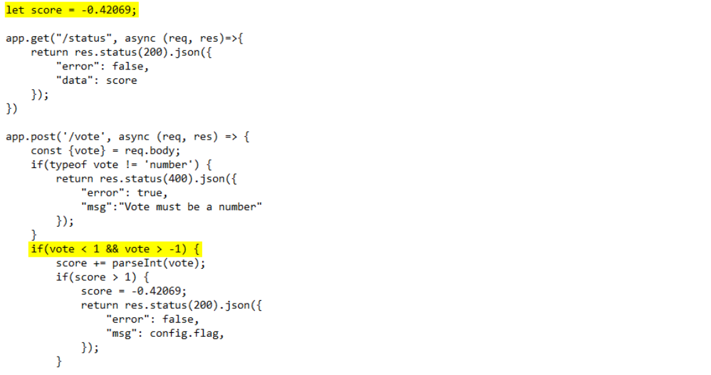
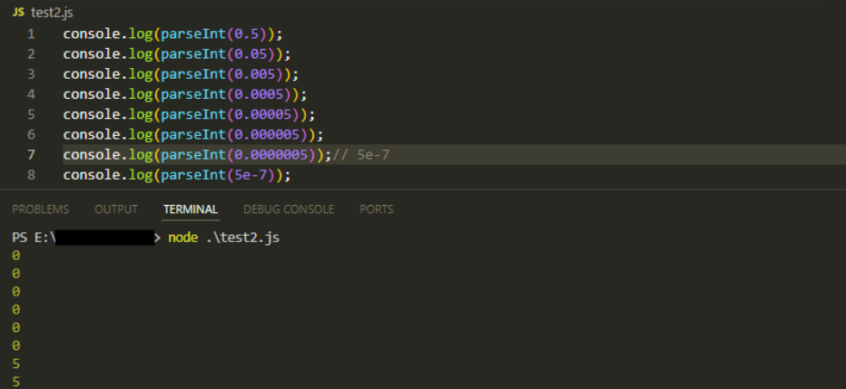
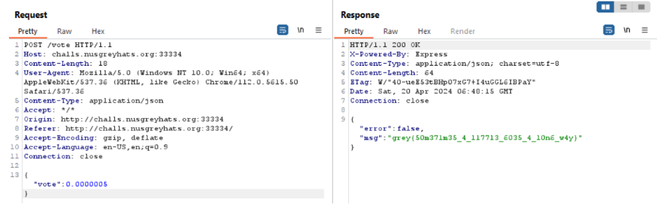

# [WEB] Greyctf Survey
## Description
Your honest feedback is appreciated :) (but if you give us a good rating we'll give you a flag)

Author: jro

http://challs.nusgreyhats.org:33334

## Approach
By entering the link, we are greeted with the following landing page, which consists of a form containing a slider for voting our satisfaction:

Using BurpSuite to intercept our requests, we can see that the request sent to the server when we submit our vote contains a JSON object with a "vote" key.

Analysing the source code provided, we see that this "vote" key must hold a value `-1 < n < 1` for our flag to be displayed. Furthermore, there exists a second variable `score`, which holds a value of -0.42069.
When we submit our vote, the "vote" value is added to the score, and only when the sum is greater than 1 will the flag be returned to us.

In order to exploit this, we need to exploit a mysterious behaviour revolving around JavaScript's `parseInt()` function.
The `parseInt()` function parses a value as a string and returns the first integer.

Normally, using the function such as `parseInt(1.2)` will return the value `1`, as the fractional part is dropped.
However, an odd behaviour is seen when we use `parseInt()` with a very small floating-point number like `0.0000005`, which returns the value `5`.

This happens because `0.0000005` is the string representation of the exponential notation, i.e. `5e-7` as the number is smaller than `10^-6`.
When parsed into an integer, `5e-7` returns `5` since `parseInt()` extracts the integer portion from the exponential notation of the float.

Back in Burpsuite, we just need to change the value of "vote" to `0.0000005`, which will cause the sum of `score` and `vote` to be greater than 1.

Flag: `grey{50m371m35_4_11713_6035_4_10n6_w4y}`
