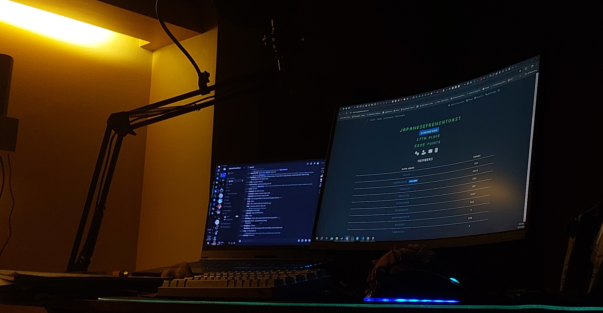
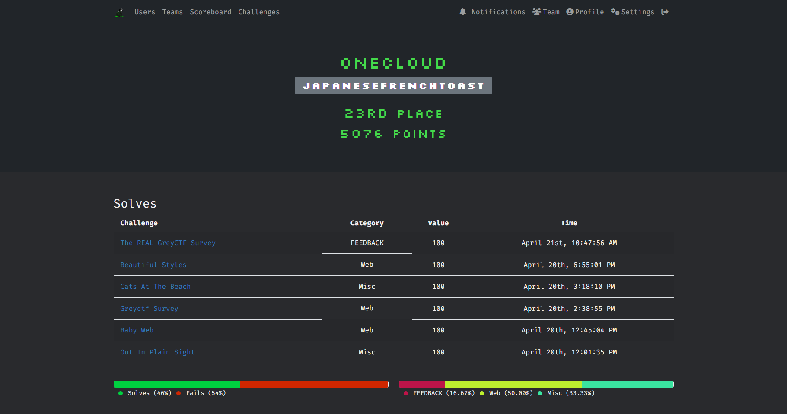

# Grey Cat The Flag 2024 [Qualifiers]

## Writeups
- [Baby Web](./Baby%20Web/)
- [Beautiful Styles](./Beautiful%20Styles/)
- [Greyctf Survey](./Greyctf%20Survey/)
- [The Motorala](./The%20Motorala/)

## About
Grey Cat The Flag is an annual CTF hosted by NUS Greyhats.

There are two categories in 2024:

1. Local Category: NSFs / Students that are currently enrolled in an educational institute in Singapore (team should consist of at least one Singapore Citizen)

2. Open Category: All participants who do not qualify for the local category /
Participants who are eligible for the local category but opts in for the open category

There will be an onsite finals for the top 20 teams in the local category. Each team may send up to 4 people for the onsite finals.

## Timeline
| dates  | events | 
| :------ | :------ |
| 20 April, 12pm to 21 April, 12pm (GMT+8) | Qualifiers, Online |
| 27 July, 10am to 28 July, 10am (GMT+8) | Finals @ NUS COM1 | 
| 10 August, 10am to 4pm (GMT+8) | GreyCTF Summit @ NUS COM1 | 

## Prizes
<table>
  <tr>
    <th>Open Category</th>
    <th>Local Category</th>
  </tr>
  <tr>
    <td>
      <table>
        <tr><th>Ranking</th><th>Prize</th></tr>
        <tr><td>1st place</td><td>SGD 2000</td></tr>
        <tr><td>2nd place</td><td>SGD 1000</td></tr>
        <tr><td>3rd place</td><td>SGD 400</td></tr>
      </table>
    </td>
    <td>
      <table>
        <tr><th>Ranking</th><th>Prize</th></tr>
        <tr><td>1st place</td><td>SGD 4000</td></tr>
        <tr><td>2nd place</td><td>SGD 2000</td></tr>
        <tr><td>3rd place</td><td>SGD 1000</td></tr>
        <tr><td>4th–10th place</td><td>SGD 400</td></tr>
        <tr><td>Secret 👀</td><td>👀👀</td></tr>
      </table>
    </td>
  </tr>
</table>

# Stats
<table>
  <tr>
    <th>Team Placing</th>
    <th>Challenges Solved</th>
  </tr>

  <tr>
    <th colspan="2">Qualifiers</th>
  </tr>
  <tr>
    <td>
      <table>
        <tr><th>Category</th><th>Position</th></tr>
        <tr><td>Global</td><td>23 / 406</td></tr>
        <tr><td>Local</td><td>13 / 156</td></tr>
      </table>
    </td>
    <td>
      <table>
        <tr><th>No.</th><th>Category</th><th>Challenge</th></tr>
        <tr><td>1</td><td>Misc</td><td>Out In Plain Sight</td></tr>
        <tr><td>2</td><td>Web</td><td>Baby Web</td></tr>
        <tr><td>3</td><td>Web</td><td>Greyctf Survey</td></tr>
        <tr><td>4</td><td>Misc</td><td>Cats At The Beach</td></tr>
        <tr><td>5</td><td>Web</td><td>Beautiful Styles</td></tr>
      </table>
    </td>
  </tr>

  <tr>
    <th colspan="2">Finals</th>
  </tr>
  <tr>
    <td>
      <table>
        <tr><th>Category</th><th>Position</th></tr>
        <tr><td>Local</td><td>8 / 20</td></tr>
      </table>
    </td>
    <td>
      <table>
        <tr><th>No.</th><th>Category</th><th>Challenge</th></tr>
        <tr><td>1</td><td>Misc</td><td>Poolside Paradise or Criminal Hideout</td></tr>
      </table>
    </td>
  </tr>
</table>

## Profile

