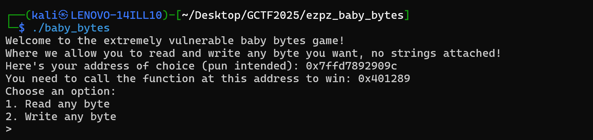
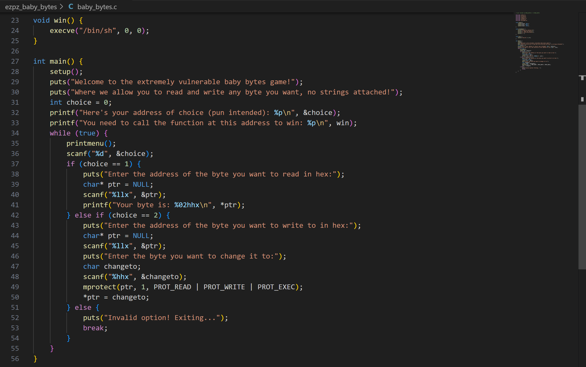
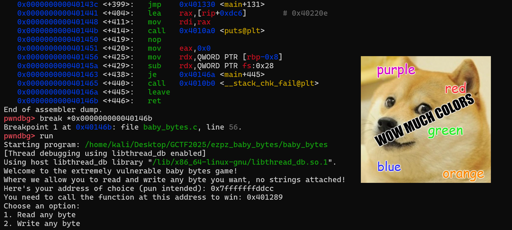
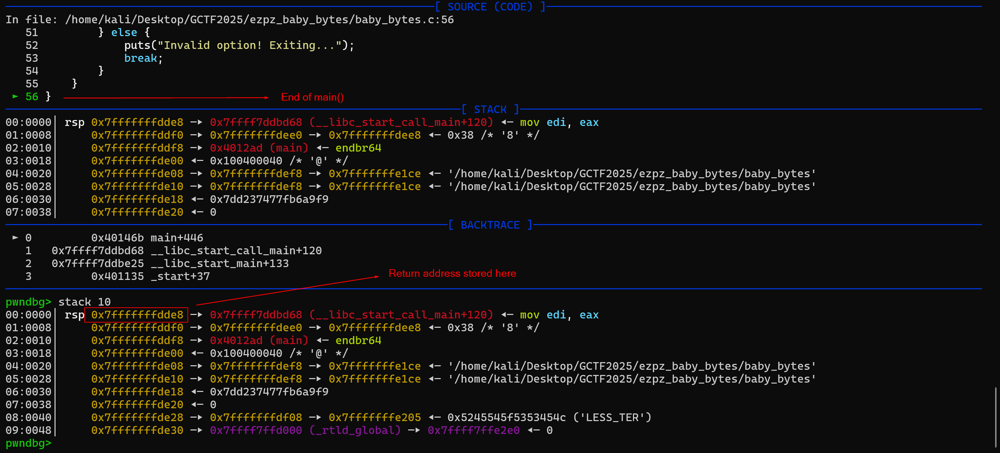
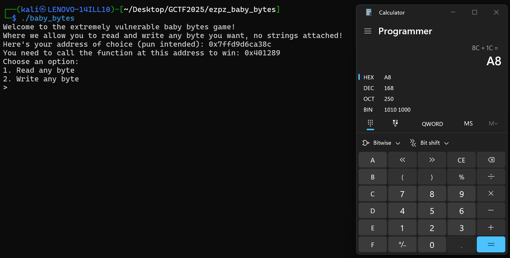
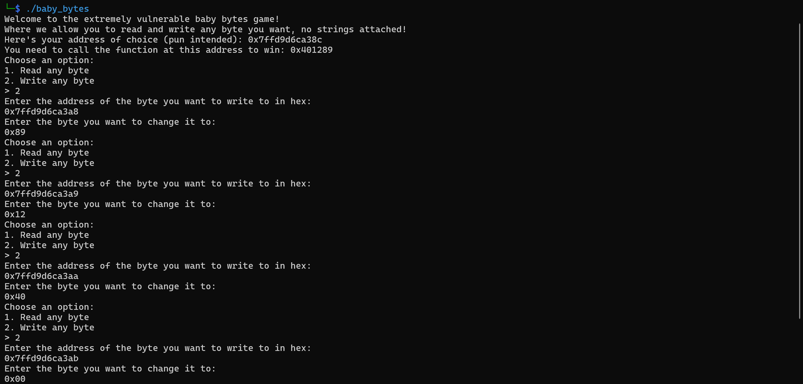
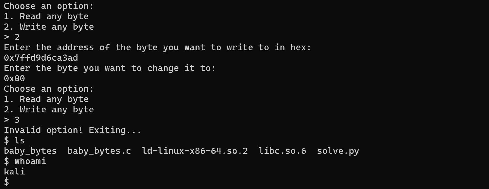
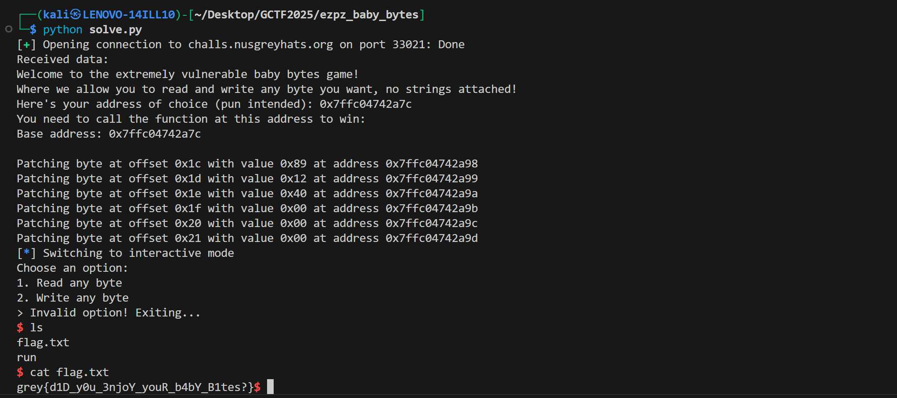

# [EZPZ] Baby Bytes
## Description
Here's a beginner pwn challenge for all my baby pwners! Overwrite the saved return address to the address of the win function, and enjoy your shell!
:D

Author: elijah5399

nc challs.nusgreyhats.org 33021

## Approach
When we run the program, we are greeted with the following output:



We are presented the following information:
1. An address for `choice`: `0x7ffd7892909c`
2. An address of a target function: `0x401289`

It seems that this is a beginner pwn challenge, whereby we are supposed to overwrite the value in some address in order to invoke a function in the binary. Looking at the source code, we can see that the function in question is named `win()`:



### Source Code Analysis

The `win()` function gives us a shell, but it is not called anywhere in the `main()` function. Therefore, we can assume that we are supposed to overwrite the return address of `main()` to force the program's execution to jump to `win()` when `main()` returns.

From both code analysis and running the binary, we can infer that we have the following capabilities:
1. Read the byte stored at an address
2. Select and overwrite the byte stored at an address

Given the luxury of being offered the literal steps to solve the challenge (as stated in the challenge description), we can list down the goals we need to achieve with this binary:
1. Figure out where the address containing the return address of `main()` is
2. Find out where this address is relative to the address given to us (`&choice`)
3. Overwrite the bytes in the address with the address bytes of our target function (`\x40\x12\x89` or `\x89\x12\x40` in little-endian)
4. Return from `main()` to jump to our overwritten return address

### Dynamic Analysis

Let's start off by finding where the return address of `main()` is stored. In pwndbg (any debugger works really), we shall find the address where `main()` returns by first running the command `disas main` to disassemble the `main()` function and finding the address where the `ret` mnemonic is located. Afterwards, place a break point there using the command `break *<ADDRESS>`:



Run the program and when the program asks you to choose an option, enter `3` to force the program to exit (`main()` will return). In pwndbg, we can view the stack using the command `stack 10`. As `main()` is returning, the top of the stack should contain the return address.



As seen from the above screenshot, the address of the top of the stack is `0x7fffffffdde8`. When the program was run to obtain the screenshot, the address of `choice` was `0x7ffc1581f88c`. Subtracting the two values, we get `0x1C`. This means that the return address of `main()` is stored at `[<ADDRESS OF CHOICE> + 0x1C]`. We also need to replace the address stored at the top of the stack (currently `0x7fffffffdde8`) with `0x000000401289`.

### Testing Locally

Let's start open up a new terminal and run the program.



Here, we can see that the address of `choice` is now `0x7ffd9d6ca38c`. This means that our return address is stored at `0x7ffd9d6ca38c + 0x1c = 0x7ffd9d6ca3a8`. We now need to overwrite the address stored at that location with `0x000000401289`. Remember that we need to write the new address in little-endian byte order, that is:

```
0x7ffd9d6ca3a8 -> 0x89
0x7ffd9d6ca3a9 -> 0x12
0x7ffd9d6ca3aa -> 0x40
0x7ffd9d6ca3ab -> 0x00
0x7ffd9d6ca3ac -> 0x00
0x7ffd9d6ca3ad -> 0x00
```



After writing each of the 6 bytes to their respective addresses, we should nter `3` when the program asks us to input an option to force `main()` to return. We should then be in the `win()` function and have a shell:



### Testing on Server

We can repeat the same process on the challenge server... except that the connection only lasts a few seconds and will most likely close when we are halfway through overwriting the byte in each address. Therefore, we need to do this quickly, with the help of a pwntools script.

I have added `solve.py` to this repository, which basically performs the same steps as previously discussed, but automated :D



Flag: `grey{d1D_y0u_3njoY_youR_b4bY_B1tes?}`

Script: [solve.py](https://raw.githubusercontent.com/0necloud/CTF-Writeups/refs/heads/main/Grey Cat The Flag 2025/Baby Bytes/solve.py)
