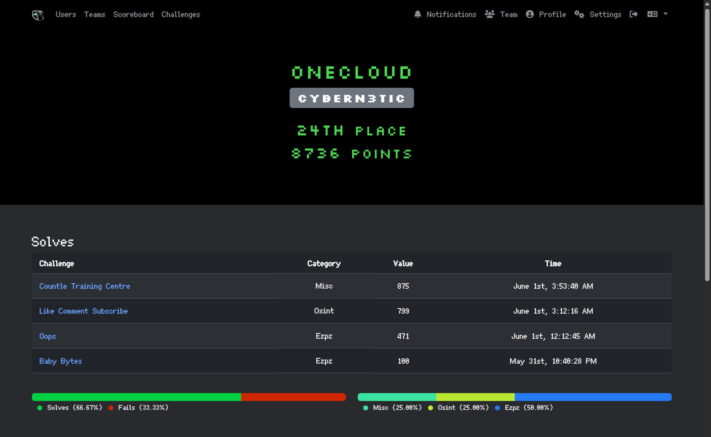

# Grey Cat The Flag 2025

## Writeups
- [Baby Bytes](./Baby%20Bytes/)
- [Countle Training Centre](./Countle%20Training%20Centre/)

## About
Grey Cat The Flag is an annual CTF hosted by NUS Greyhats.

There are two categories in 2025:

1. Local Category: NSFs / Students that are currently enrolled in an educational institute in Singapore (team should consist of at least one Singapore Citizen), Singapore Citizens studying in an overseas institution

2. Open Category: All participants who do not qualify for the local category /
Participants who are eligible for the local category but opts in for the open category

There will be an onsite finals for the top 20 teams in the local category. Each team may send up to 4 people for the onsite finals.

## Timeline
| dates                                  | events                    |
| :------------------------------------- | :------------------------ |
| 31 May, 8pm to 1 June, 8pm (GMT+8)     | Qualifiers, Online        |
| 28 June, 10am to 29 June, 10am (GMT+8) | Finals @ NUS COM1         |
| 5 July, 9am to 5.30pm (GMT+8)          | GreyCTF Summit @ NUS COM1 |

## Prizes
<table>
  <tr>
    <th>Open Category</th>
    <th>Local Category</th>
  </tr>
  <tr>
    <td>
      <table>
        <tr><th>Ranking</th><th>Prize</th></tr>
        <tr><td>1st place</td><td>SGD 2000</td></tr>
        <tr><td>2nd place</td><td>SGD 1000</td></tr>
        <tr><td>3rd place</td><td>SGD 500</td></tr>
      </table>
    </td>
    <td>
      <table>
        <tr><th>Ranking</th><th>Prize</th></tr>
        <tr><td>1st place</td><td>SGD 6000</td></tr>
        <tr><td>2nd place</td><td>SGD 4000</td></tr>
        <tr><td>3rd place</td><td>SGD 2500</td></tr>
        <tr><td>4th place</td><td>SGD 1500</td></tr>
        <tr><td>5th place</td><td>SGD 1000</td></tr>
        <tr><td>6th–10th place</td><td>SGD 500</td></tr>
        <tr><td>Special Prizes</td><td>Stay Tuned!</td></tr>
      </table>
    </td>
  </tr>
</table>

# Stats
<table>
  <tr>
    <th>Team Placing</th>
    <th>Challenges Solved</th>
  </tr>

  <tr>
    <th colspan="2">Qualifiers</th>
  </tr>
  <tr>
    <td>
      <table>
        <tr><th>Category</th><th>Position</th></tr>
        <tr><td>Global</td><td>24 / 776</td></tr>
        <tr><td>Local</td><td>10 / 246</td></tr>
      </table>
    </td>
    <td>
      <table>
        <tr><th>No.</th><th>Category</th><th>Challenge</th></tr>
        <tr><td>1</td><td>Ezpz</td><td>Baby Bytes</td></tr>
        <tr><td>2</td><td>Ezpz</td><td>Oops</td></tr>
        <tr><td>3</td><td>Misc</td><td>Countle Training Centre</td></tr>
        <tr><td>4</td><td>Osint</td><td>Like Comment Subscribe</td></tr>
      </table>
    </td>
  </tr>

 <tr>
    <th colspan="2">Finals</th>
  </tr>
  <tr>
    <td>
      <table>
        <tr><th>Category</th><th>Position</th></tr>
        <tr><td>Local</td><td>16 / 20</td></tr>
      </table>
    </td>
    <td>
      <table>
        <tr><th>No.</th><th>Category</th><th>Challenge</th></tr>
        <tr><td>1</td><td>Misc</td><td>Authlab</td></tr>
        <tr><td>2</td><td>Web</td><td>A4 Toilet Paper</td></tr>
      </table>
    </td>
  </tr>
</table>

## Profile

