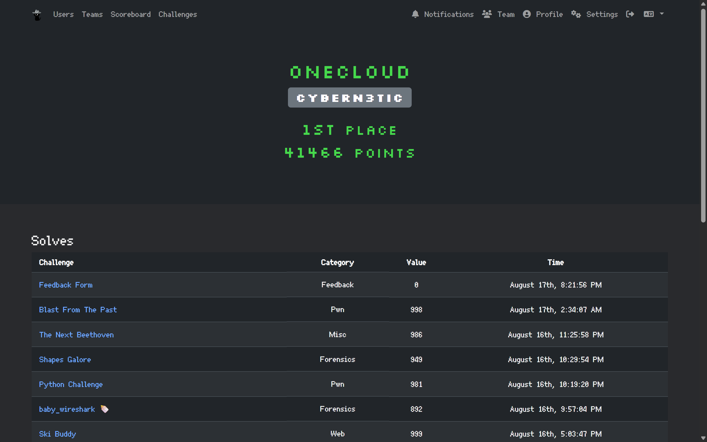

# Greyhats Welcome CTF 2025

## Writeups
- [Ski Buddy](./Ski%20Buddy/)
- [Rusty Vending Machine](./Rusty%20Vending%20Machine/)
- [Blast From The Past](./Blast%20From%20The%20Past/)
- [Python Challenge](./Python%20Challenge/)

## About
This is a (supposedly) beginner-friendly CTF hosted by the NUS Greyhats.

## Timeline

| dates                                    | events                    |
| :--------------------------------------- | :------------------------ |
| 16 August, 9am to 17 August, 9pm (GMT+8) | Online CTF                |

# Stats
<table>
  <tr>
    <th>Team Placing</th>
    <th>Challenges Solved</th>
  </tr>

  <tr>
    <td>
      <table>
        <tr><th>Category</th><th>Position</th></tr>
        <tr><td>Local</td><td>1 / 126</td></tr>
      </table>
    </td>
    <td>
      <table>
        <tr><th>No.</th><th>Category</th><th>Challenge</th><th>First Blood</th></tr>
        <tr><td>1</td><td>Pwn</td><td>Machine Code Repl 🍼</td><td>✅</td></tr>
        <tr><td>2</td><td>Osint</td><td>Party In The Usa</td><td></td></tr>
        <tr><td>3</td><td>Crypto</td><td>Please Clone Bthe Ciphertext</td><td></td></tr>
        <tr><td>4</td><td>Pwn</td><td>Rusty Vending Machine</td><td></td></tr>
        <tr><td>5</td><td>Web</td><td>Ski Buddy</td><td>✅</td></tr>
        <tr><td>6</td><td>Forensics</td><td>baby_wireshark 🍼</td><td></td></tr>
        <tr><td>6</td><td>Pwn</td><td>Python Challenge</td><td>✅</td></tr>
        <tr><td>7</td><td>Forensics</td><td>Shapes Galore</td><td></td></tr>
        <tr><td>8</td><td>Misc</td><td>The Next Beethoven</td><td></td></tr>
        <tr><td>9</td><td>Pwn</td><td>Blast From The Past</td><td></td></tr>
      </table>
    </td>
  </tr>
</table>

## Profile
