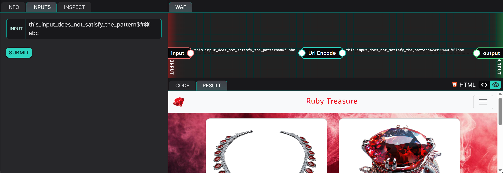
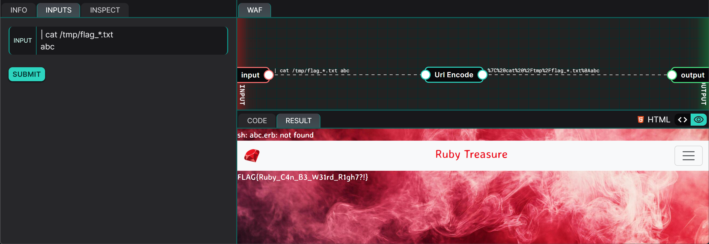

## Description
This challenge revolves around a Ruby Web Application that allows users to supply an input to navigate to a corresponding page (i.e., login, collection). However, due to inadequate validation and sanitisation of user input, a malicious attacker may supply a specially crafted input to execute commands on the web server. This is primarily due to quirks related to regular expressions in Ruby, where the use of `^` and `$` matches the start and end of a line, rather than the entire string. As a results, an attacker can bypass a regular expression simply by supplying a line feed (`\n`) followed by a line that matches the expected pattern, thereby passing validation.

## Exploitation
To identify potential vulnerabilities within an application,  analysing the source code is an effective approach as it reveals insecure coding practices, such as improper input validation or the misuse of certain libraries. In this scenario, we are presented with a web application that accepts a user input, which is then parsed by the program - potentially influencing the contents returned to the user.

### Code Analysis
The first step in performing our taint tracking is to examine how our input is being handled by the program. In this scenario, a Web Application Firewall URL-encodes the user input before it reaches the web server.

```ruby
filename = CGI.unescape("<USER_INPUT>")
content = ""

if validateFile(filename)
    begin
        content = IO.read("#{filename}.erb")
    rescue
        content = IO.read("collection.erb")
    end
    
end
```

The user input (denoted by `<USER_INPUT>`) is first decoded using the `CGI.unescape()` function, which returns it to its original form before being passed to the `validateFile()` function. Either the `validateFile()` function must return a truthy value, or the input must be empty, for the `content` variable to be populated.

```ruby
def validateFile(filename)
    return !!/^[a-zA-Z0-9_-]+$/.match(filename) || filename.length == 0
end
```

The `validateFile()` function performs a regular expression matching using the pattern `/^[a-zA-Z0-9_-]+$/` to ensure that the input should only contain alphanumeric characters, underscores (`_`), and dashes (`-`). The double exclamation marks `!!` apply logical negation twice to the result of the regular expression's match, casting the output to a boolean value.

```ruby
puts ERB.new(IO.read("index.erb")).result_with_hash({page: content})
```

After the user input is validated, the core template file `index.erb`, injects the contents of a `.erb` template file, whose name corresponds to the value stored in the `content` variable.

### Conclusions drawn from Code Analysis
While the user input validation function `validateFile()` seems secure at first glance, it overlooks how the regular expression is actually matched in Ruby. `^` and `$` matches the start and end of a **line**, not the entire input string. To match the entire string, `\A` and `/z` should be used instead. 

This oversight means that an attacker can bypass the validation by submitting a multi-line input such as:

```
this_input_does_not_satisfy_the_pattern$#@!
abc
```

Although the first line (`this_input_does_not_satisfy_the_pattern$#@!`) fails validation due to the illegal characters (`$#@!`), the second line (`abc`) passes. As a result, the `validateFile()` function returns a truthy value, tricking the program into accepting the user input as valid and allowing its contents to be parsed.



In the image above, the user input passed validation but since the template file `this_input_does_not_satisfy_the_pattern$#@!\nabc.erb` does not exist, `collection.erb` was returned instead.

Another point of interest for attackers would be the

```ruby
IO.read("#{filename}.erb")
```

function called after input validation passes. With the `IO.read()` function, an attacker can force the web server to run Operating System commands by passing the string value `| <OS_COMMAND>` where `<OS_COMMAND>` is to be replaced with the commands an attacker wishes the web server to run (e.g. `ls -al`).

Combining the two observations together, the attacker will be able to read the `/etc/passwd` file by supplying the following input:

```
| cat /etc/passwd
abc
```


## Proof of Concept
The Proof of Concept (PoC) involves combining the observations derived from the previous section to perform a Remote Code Execution (RCE) and read the flag file stored on the web server.



**PAYLOAD:**
```
| cat /tmp/flag_*.txt
abc
```

**FLAG: `FLAG{Ruby_C4n_B3_W31rd_R1gh7?!}`**

## Risk
This vulnerability presents a serious risk as it allows an attacker to execute arbitrary commands on the web server. As a result, the attacker is capable of:
1. Reading files **(confidentiality compromised)**
2. Writing/Overwriting files **(integrity compromised)**
3. Deleting Files **(availability compromised)**

## Remediation
To remediate the vulnerability, the regular expression should be changed from `/^[a-zA-Z0-9_-]+$/` to `/\A[a-zA-Z0-9_-]+\z/` to match the entire user input string.

Additionally, a whitelist/blacklist of allowed/disalllowed words can be used to ensure that user input is further restricted.

