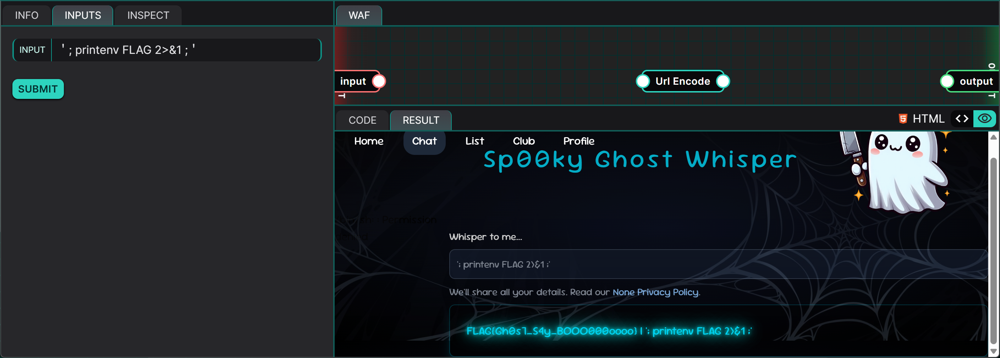
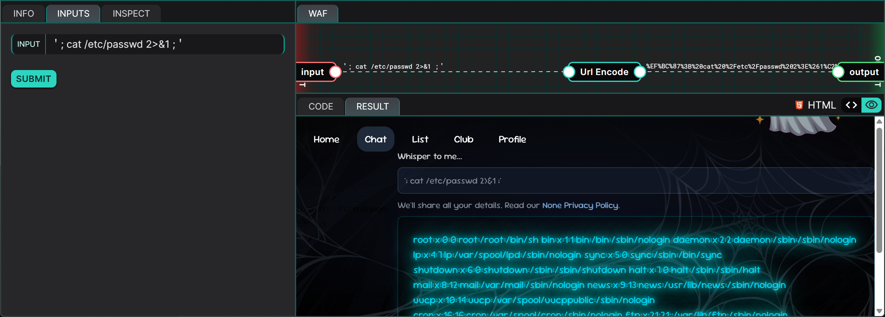

## Description
This challenge revolves around a Python web application that allows users to "whisper" to a ghost. The application takes in a user-supplied message, sanitises it, and processes it using a system command (i.e., `hexdump`) before it is displayed on the front end.

However, the input validation routine contains a logical flaw, whereby the application sanitises the input before normalising it, opening the door to an OS Command Injection vulnerability. By supplying specific Unicode characters, the attacker can bypass the filter and inject arbitrary commands, allowing them to retrieve sensitive information or take control of the server.

## Vulnerability Details
To identify potential vulnerabilities within the application, a static code analysis of the source code was performed. This revealed an error in the order in which user input was processed, before the user input is eventually executed in an OS shell command.

### Code Analysis
The vulnerable logic was located in the `main` function .

```python
def main():
    whisperMsg = unquote(USER_INPUT)

    # Normalize dangerous characters
    whisperMsg = unicodedata.normalize("NFKC", whisperMsg.replace("'", "_"))

    # Run a command and capture its output
    with os.popen(f"echo -n '{whisperMsg}' | hexdump") as stream:
        hextext = f"{stream.read()} | {whisperMsg}"
        print( template.render(msg=whisperMsg, hextext=hextext) )
```

The order of execution is as follows:
1. **Input:**  `unquote(USER_INPUT)` decodes the URL-encoded payload.
2. **Sanitisation:** `whisperMsg.replace("'", "_")` attempts to neutralise injection by replacing single quotes with underscores.
3. **Normalisation:** `unicodedata.normalize("NFKC", ...)` canonicalises the input after it has been sanitised.
4. **Injection:** The resulting string is inserted into an f-string and executed as a shell command: `os.popen(f"echo -n '{whisperMsg}' | hexdump")`.

### Exploitation Strategy
From the code analysis performed, we can observe that this is a **Incorrect Behavior Order: Validate Before Canonicalize (CWE-180)** vulnerability. 

Here are key points to take note of:
1. The sanitisation steps only involve filtering out the standard ASCII apostrophe (`'`) using the `replace` function. It does not work on homoglyphs (characters from different alphabets or character sets that look visually identical or very similar but have different underlying codes). 
2. The `NFKC` normalisation converts homoglyphs into their standard ASCII equivalents. For example, the Fullwidth Apostrophe character `＇` (U+FF07) is converted to the standard Apostrophe `'` (U+0027).

Because the normalisation happens after the sanitisation, we can smuggle the Fullwidth Apostrophe past the filter (`replace` function). The application would then convert it into a dangerous single quote inside the shell command string, allowing us to break out of the `echo` context.

## PoC
To test the vulnerability, I created the following payload with the intention of breaking out of the `echo` context by closing the statement using a single quote. Since a normal single quote gets replaced, a Fullwidth Apostrophe is used instead. The `2>&1` ensures that the standard error streams are also captured. The first semicolon (`;`) is used to terminate the `echo` command. We will need to have one at the end of our payload too in order to separate our payload from any following "garbage". The ending Fullwidth Apostrophe is also required to close the trailing quote in the hardcoded Python source code.

```
＇; printenv FLAG 2>&1 ;＇
```

### Execution Flow
1. **Input:** `＇; printenv FLAG 2>&1 ;＇`
2. **Sanitisation:** `replace("'", "_")` finds no matches so the input is not altered.
3. **Normalisation:** `NFKC` converts the Fullwidth Apostrophe (`＇`) to a regular single quote (`'`).
4. **OS Executes:** `echo -n ''; printenv FLAG 2>&1 ; '' | hexdump` and displays the `FLAG` environment variable.



**PAYLOAD:** `＇; printenv FLAG 2>&1 ;＇`

**FLAG:** `FLAG{Gh0s7_S4y_BOOO000oooo}`

## Risk
This vulnerability presents a serious risk as it allows an attacker to execute arbitrary commands on the web server. As a result, the attacker is capable of:
1. Reading files **(confidentiality compromised)**
2. Writing/Overwriting files **(integrity compromised)**
3. Deleting Files **(availability compromised)**

For example, we can read the contents of the `/etc/passwd` files using the payload `＇; cat /etc/passwd 2>&1 ;＇`:



## Remediation
To remediate this vulnerability, the order of operations must be corrected. Input normalisation must be performed before sanitisation to ensure that filtering is done on the final data that gets sent to the `echo` command.

```python
whisperMsg = unicodedata.normalize("NFKC", whisperMsg)
whisperMsg = whisperMsg.replace("'", "_")
```